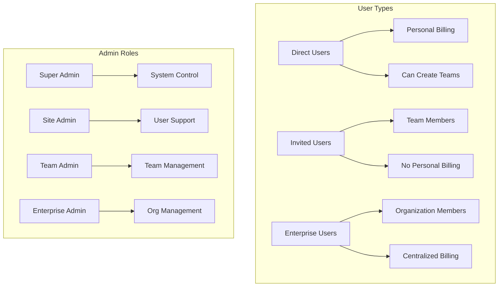

# System Architecture Overview

## Table of Contents
1. [System Overview](#system-overview)
2. [User Architecture](#user-architecture)
3. [Database Design](#database-design)
4. [Authentication & Authorization](#authentication--authorization)
5. [Billing Architecture](#billing-architecture)
6. [Email System](#email-system)
7. [Frontend Architecture](#frontend-architecture)
8. [Security Architecture](#security-architecture)
9. [Testing Architecture](#testing-architecture)
10. [Deployment Architecture](#deployment-architecture)

## System Overview

The SaaS Rails Starter is a production-ready Rails 8.0.2 application implementing a sophisticated triple-track user system with comprehensive security, billing, and administrative features.

### Core Principles
- **Separation of Concerns**: Clear boundaries between user types
- **Security First**: Multiple layers of protection
- **Scalability**: Designed for growth
- **Maintainability**: Clean, well-documented code
- **User Experience**: Professional UI with responsive design

### Technology Stack
```
Backend:
├── Rails 8.0.2
├── Ruby 3.2.5
├── SQLite3 (development)
├── PostgreSQL (production)
└── Redis (caching/jobs)

Frontend:
├── Tailwind CSS
├── Stimulus.js
├── Turbo
├── ViewComponent
└── Phosphor Icons

Services:
├── Stripe (payments)
├── Letter Opener (dev emails)
├── Ahoy Matey (analytics)
└── Solid Queue (jobs)
```

## User Architecture

### Triple-Track System



### User State Machine

```ruby
# User Status Transitions
active → inactive (admin action)
active → locked (security action)
inactive → active (admin reactivation)
locked → active (admin unlock)

# User Type Transitions
None (types are immutable after creation)
```

### Registration Flows

1. **Direct User Registration**
   ```
   /users/sign_up → Choose Plan → Create Account → Confirm Email → Access Dashboard
   ```

2. **Team Invitation Flow**
   ```
   Admin Sends Invite → Email Delivered → Accept Invitation → Create Account → Join Team
   ```

3. **Enterprise Invitation Flow**
   ```
   Super Admin Creates Group → Admin Invitation → Accept & Become Admin → Invite Members
   ```

## Database Design

### Core Tables Structure

```sql
-- Users (Polymorphic associations based on user_type)
users
├── id
├── email (unique)
├── user_type (direct|invited|enterprise)
├── system_role (user|site_admin|super_admin)
├── status (active|inactive|locked)
├── team_id (for invited users)
├── team_role (member|admin)
├── enterprise_group_id (for enterprise users)
├── enterprise_group_role (member|admin)
└── owns_team (boolean)

-- Teams
teams
├── id
├── name
├── slug (unique)
├── admin_id → users
├── created_by_id → users
├── plan_id → plans
└── stripe_customer_id

-- Enterprise Groups
enterprise_groups
├── id
├── name
├── slug (unique)
├── admin_id → users (optional)
├── created_by_id → users
├── plan_id → plans
└── stripe_customer_id

-- Invitations (Polymorphic)
invitations
├── id
├── email
├── token (unique)
├── role
├── invitation_type (team|enterprise)
├── invitable_type (Team|EnterpriseGroup)
├── invitable_id
├── invited_by_id → users
├── accepted_at
└── expires_at
```

### Key Relationships

```ruby
# User Associations
belongs_to :team, optional: true
belongs_to :enterprise_group, optional: true
has_many :owned_teams, -> { where(owns_team: true) }

# Team Associations
belongs_to :admin, class_name: "User"
has_many :users
has_many :invitations, as: :invitable

# Enterprise Group Associations
belongs_to :admin, class_name: "User", optional: true
has_many :users
has_many :invitations, as: :invitable
```

### Database Constraints

```sql
-- User constraints
CHECK (
  (user_type = 'direct' AND team_id IS NULL AND enterprise_group_id IS NULL) OR
  (user_type = 'invited' AND team_id IS NOT NULL AND enterprise_group_id IS NULL) OR
  (user_type = 'enterprise' AND team_id IS NULL AND enterprise_group_id IS NOT NULL)
)

-- Invitation constraints
CHECK (
  NOT EXISTS (SELECT 1 FROM users WHERE users.email = invitations.email)
)
```

## Authentication & Authorization

### Devise Configuration

```ruby
# 8 Security Modules Active
devise :database_authenticatable,   # Password authentication
       :registerable,              # User registration
       :recoverable,              # Password reset
       :rememberable,             # Remember me functionality
       :validatable,              # Email/password validation
       :confirmable,              # Email confirmation
       :lockable,                 # Account locking
       :trackable                 # Sign in tracking
```

### Pundit Policy Structure

```
app/policies/
├── application_policy.rb       # Base policy
├── user_policy.rb             # User management
├── team_policy.rb             # Team access
├── enterprise_group_policy.rb # Enterprise access
├── invitation_policy.rb       # Invitation management
└── plan_policy.rb            # Plan administration
```

### Authorization Flow

```ruby
# Controller
before_action :authenticate_user!
after_action :verify_authorized

# Action
def update
  authorize @team
  # ... update logic
end

# Policy
def update?
  super_admin? || team_admin?
end
```

## Billing Architecture

### Stripe Integration via Pay Gem

```ruby
# Billable Models
class User < ApplicationRecord
  include Pay::Billable  # For direct users
end

class Team < ApplicationRecord
  include Pay::Billable  # For teams
end

class EnterpriseGroup < ApplicationRecord
  include Pay::Billable  # For enterprise
end
```

### Subscription Flow

```
1. Choose Plan → 2. Create Customer → 3. Add Payment Method → 4. Create Subscription
```

### Plan Structure

```ruby
plans
├── individual_plans
│   ├── free
│   ├── pro ($19/mo)
│   └── premium ($49/mo)
├── team_plans
│   ├── starter ($49/mo, 5 members)
│   ├── pro ($99/mo, 15 members)
│   └── enterprise ($199/mo, 100 members)
└── enterprise_plans
    └── custom (contact sales)
```

## Email System

### Email Types

1. **Authentication Emails**
   - Confirmation instructions
   - Password reset
   - Unlock instructions

2. **Invitation Emails**
   - Team invitations
   - Enterprise invitations
   - Reminder emails

3. **Billing Emails**
   - Payment receipts
   - Failed payment notifications
   - Subscription changes

### Email Configuration

```ruby
# Development
config.action_mailer.delivery_method = :letter_opener
config.action_mailer.perform_deliveries = true

# Production
config.action_mailer.delivery_method = :smtp
config.action_mailer.smtp_settings = {
  address: ENV['SMTP_ADDRESS'],
  port: ENV['SMTP_PORT'],
  authentication: :plain,
  user_name: ENV['SMTP_USERNAME'],
  password: ENV['SMTP_PASSWORD']
}
```

## Frontend Architecture

### ViewComponent Structure

```
app/components/
├── tab_navigation_component.rb   # Reusable tabs
├── flash_component.rb           # Flash messages
├── modal_component.rb           # Modals
└── stats_card_component.rb      # Dashboard stats
```

### Stimulus Controllers

```javascript
// app/javascript/controllers/
├── flash_controller.js          // Auto-dismiss flash
├── modal_controller.js          // Modal interactions
├── tabs_controller.js           // Tab persistence
└── form_controller.js          // Form enhancements
```

### Tailwind Configuration

```javascript
// Extend default theme
extend: {
  colors: {
    primary: colors.indigo,
    success: colors.green,
    warning: colors.yellow,
    danger: colors.red,
    enterprise: colors.purple
  }
}
```

### Icon System

```erb
<!-- Phosphor icons via rails_icons -->
<%= icon "phosphor-user", class: "w-5 h-5" %>
<%= icon "phosphor-gear", class: "w-5 h-5" %>
<%= icon "phosphor-buildings", class: "w-5 h-5" %>
```

## Security Architecture

### Rack::Attack Configuration

```ruby
# Rate Limiting
throttle('req/ip', limit: 300, period: 5.minutes)
throttle('logins/ip', limit: 5, period: 20.seconds)
throttle('logins/email', limit: 5, period: 20.seconds)
throttle('signups/ip', limit: 3, period: 1.hour)

# Blocklists
blocklist('bad-agents') { |req| SUSPICIOUS_AGENTS.include?(req.user_agent) }
blocklist('bad-paths') { |req| req.path =~ SUSPICIOUS_PATHS }

# Fail2ban
blocklist('fail2ban') { |req| Rack::Attack::Fail2Ban.filter(...) }
```

### Session Security

```ruby
# config/initializers/session_store.rb
Rails.application.config.session_store :cookie_store,
  key: '_saas_session',
  secure: Rails.env.production?,
  httponly: true,
  same_site: :lax
```

### CSRF Protection

```ruby
class ApplicationController < ActionController::Base
  protect_from_forgery with: :exception
  
  # Enhanced CSRF for critical actions
  def verify_critical_csrf_token
    verify_authenticity_token
    return if request.headers['X-CSRF-Token'] == form_authenticity_token
    handle_unverified_request
  end
end
```

## Testing Architecture

### Test Stack

```ruby
# Minitest with enhancements
gem "minitest-rails"
gem "minitest-reporters"
gem "simplecov"

# System tests
gem "capybara"
gem "selenium-webdriver"
```

### Test Organization

```
test/
├── models/           # Unit tests
├── controllers/      # Controller tests
├── system/          # Integration tests
├── services/        # Service object tests
├── policies/        # Policy tests
├── components/      # ViewComponent tests
└── helpers/         # Helper tests
```

### Test Helpers

```ruby
# Authentication helpers
def sign_in_as(user)
  post user_session_path, params: {
    user: { email: user.email, password: 'password' }
  }
end

# Factory methods
def create_user_with_team
  user = create(:user, :direct)
  team = create(:team, admin: user)
  user.update(owns_team: true)
  [user, team]
end
```

### Coverage Configuration

```ruby
SimpleCov.start 'rails' do
  enable_coverage :branch
  
  add_group "Services", "app/services"
  add_group "Policies", "app/policies"
  add_group "Components", "app/components"
  
  minimum_coverage 90
  minimum_coverage_by_file 80
end
```

## Deployment Architecture

### Docker Configuration

```dockerfile
FROM ruby:3.2.5-slim
# Multi-stage build for smaller images
# Includes all dependencies
# Precompiled assets
# Health checks included
```

### Kamal Deployment

```yaml
# config/deploy.yml
service: saas_app
image: your-registry/saas_app

servers:
  web:
    - your-server.com
    
registry:
  server: your-registry.com
  username: deploy
  
env:
  clear:
    RAILS_ENV: production
  secret:
    - RAILS_MASTER_KEY
    - DATABASE_URL
```

### Environment Structure

```
Development:
├── SQLite database
├── Letter opener emails
├── Debug tools enabled
└── Relaxed security

Production:
├── PostgreSQL database
├── Redis cache/jobs
├── SMTP email delivery
├── Full security enabled
└── Error monitoring
```

### Monitoring & Logging

```ruby
# Structured logging
config.log_tags = [:request_id, :user_id, :team_id]

# Error tracking (future)
# Sentry.init do |config|
#   config.dsn = ENV['SENTRY_DSN']
# end

# Performance monitoring
# Skylight.start!
```

## Performance Considerations

### Database Optimization

```ruby
# Indexes
add_index :users, :email, unique: true
add_index :users, [:user_type, :status]
add_index :teams, :slug, unique: true
add_index :invitations, :token, unique: true
add_index :invitations, [:invitable_type, :invitable_id]

# Counter caches
counter_cache: :members_count
counter_cache: :invitations_count
```

### Caching Strategy

```ruby
# Fragment caching
cache @team do
  render 'team_card', team: @team
end

# Russian doll caching
cache [@team, @team.users] do
  render 'team_members'
end

# Low-level caching
Rails.cache.fetch("stats/#{Date.current}") do
  calculate_expensive_stats
end
```

### Background Jobs

```ruby
# Email delivery
InvitationMailer.with(invitation: @invitation).invite.deliver_later

# Billing webhooks
StripeWebhookJob.perform_later(event)

# Cleanup tasks
ExpiredInvitationsCleanupJob.perform_later
```

## Scalability Roadmap

### Phase 1: Current Architecture
- Single server deployment
- PostgreSQL database
- Redis for caching/jobs
- CDN for assets

### Phase 2: Horizontal Scaling
- Multiple application servers
- Load balancer
- Dedicated job workers
- Read replicas

### Phase 3: Microservices
- Extract billing service
- Separate analytics service
- API gateway
- Event-driven architecture

### Phase 4: Global Scale
- Multi-region deployment
- Database sharding
- Edge computing
- Real-time features