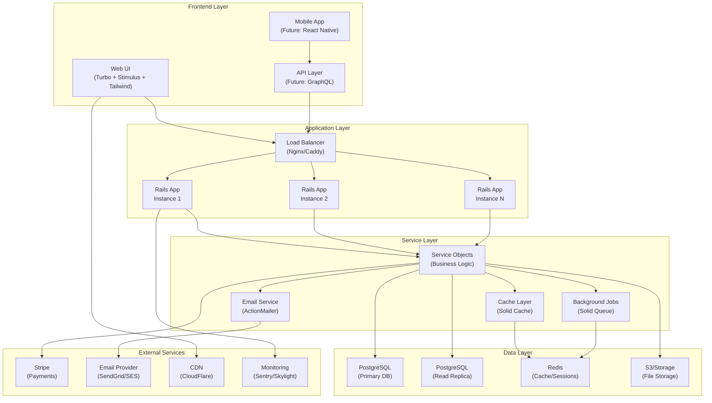

# System Overview

## Introduction

The SaaS Rails Starter Kit is a production-ready Rails 8.0.2 application implementing a sophisticated triple-track user system with comprehensive security, billing, and administrative features. This document provides a high-level overview of the system architecture, core principles, and technology choices.

## Core Architecture Principles

### 1. Separation of Concerns
- **Clear boundaries** between user types (Direct, Invited, Enterprise)
- **Service objects** for complex business logic encapsulation
- **Policy objects** for authorization rules
- **Modular design** enabling independent feature development

### 2. Security First
- **Defense in depth** with multiple security layers
- **Zero-trust approach** to user permissions
- **Comprehensive audit logging** for accountability
- **Secure by default** configuration

### 3. Scalability by Design
- **Stateless application** architecture
- **Database query optimization** with proper indexing
- **Caching strategies** at multiple levels
- **Background job processing** for heavy operations

### 4. Maintainability
- **Consistent coding patterns** across the codebase
- **Comprehensive documentation** for all components
- **Extensive test coverage** (target: 90%+)
- **Clear upgrade paths** for dependencies

### 5. User Experience
- **Professional UI** with responsive design
- **Real-time updates** using Turbo
- **Accessible components** following WCAG guidelines
- **Consistent interaction patterns**

## Technology Stack

### Backend Framework
```
Core:
├── Rails 8.0.2          # Latest Rails with all modern features
├── Ruby 3.2.5           # Latest stable Ruby
├── SQLite3              # Development database
├── PostgreSQL           # Production database
└── Redis                # Caching and background jobs
```

### Frontend Stack
```
UI Framework:
├── Tailwind CSS 3.x     # Utility-first CSS framework
├── Stimulus.js          # Modest JavaScript framework
├── Turbo                # SPA-like navigation
├── Import Maps          # Modern JS without bundling
└── Phosphor Icons       # Comprehensive icon library
```

### Third-Party Services
```
Services:
├── Stripe               # Payment processing
├── Letter Opener        # Development email testing
├── Ahoy Matey          # Privacy-friendly analytics
├── Blazer              # Business intelligence
└── Solid Suite         # Cache, Queue, Cable
```

### Development Tools
```
Quality:
├── Minitest            # Testing framework
├── SimpleCov           # Code coverage
├── Rubocop             # Code style enforcement
├── Brakeman            # Security scanning
└── Bullet              # N+1 query detection
```

## System Architecture Diagram



## Application Architecture Layers

### 1. Presentation Layer
- **Controllers**: RESTful resource controllers with clear namespace separation
- **Views**: ERB templates with ViewComponent for reusability
- **Assets**: Tailwind CSS with custom components
- **JavaScript**: Stimulus controllers for interactivity

### 2. Business Logic Layer
- **Service Objects**: Encapsulate complex operations (e.g., `Teams::CreationService`)
- **Form Objects**: Handle complex form validations
- **Query Objects**: Encapsulate complex database queries
- **Decorators**: Presentation logic separation

### 3. Domain Layer
- **Models**: ActiveRecord models with business rules
- **Validators**: Custom validation logic
- **Concerns**: Shared model functionality
- **Callbacks**: Lifecycle management

### 4. Infrastructure Layer
- **Database**: PostgreSQL with optimized indexes
- **Cache**: Redis-backed Solid Cache
- **Queue**: Database-backed Solid Queue
- **Storage**: Active Storage with S3

## Key Design Decisions

### 1. Triple-Track User System
**Decision**: Complete separation between Direct, Invited, and Enterprise users

**Rationale**: 
- Simplifies billing logic (individual vs team vs enterprise)
- Clear permission boundaries
- Better user experience with focused features
- Easier to maintain and extend

**Trade-offs**:
- Users cannot switch between types
- Some code duplication across user types
- More complex initial setup

### 2. Database-Enforced Constraints
**Decision**: Business rules enforced at database level with check constraints

**Rationale**:
- Data integrity regardless of application bugs
- Protection against direct database manipulation
- Clear documentation of business rules
- Better performance for constraint checking

**Trade-offs**:
- More complex migrations
- Database-specific features (less portable)
- Harder to change business rules

### 3. Service Object Pattern
**Decision**: Complex operations encapsulated in service classes

**Rationale**:
- Single Responsibility Principle
- Easier testing of business logic
- Reusable across controllers
- Clear operation boundaries

**Trade-offs**:
- Additional abstraction layer
- More files to maintain
- Learning curve for new developers

### 4. Monolithic Architecture
**Decision**: Single Rails application vs microservices

**Rationale**:
- Simpler deployment and operations
- Faster development iteration
- Lower operational complexity
- Easier debugging and monitoring

**Trade-offs**:
- Scaling limitations at extreme scale
- Single point of failure
- Technology lock-in
- Deployment affects entire system

## Environment Architecture

### Development Environment
```yaml
Database: SQLite3 (simple, fast, file-based)
Cache: Memory store
Queue: Inline processing
Email: Letter Opener (browser preview)
Assets: Live reloading
Security: Relaxed for development
```

### Test Environment
```yaml
Database: SQLite3 (in-memory)
Cache: Null store
Queue: Test adapter
Email: Test delivery
Assets: Precompiled
Security: Full validation
```

### Production Environment
```yaml
Database: PostgreSQL (robust, scalable)
Cache: Redis + Solid Cache
Queue: Solid Queue with Redis
Email: SMTP provider
Assets: CDN delivery
Security: Full hardening
```

## Deployment Architecture

### Container-Based Deployment
```dockerfile
# Multi-stage build for optimization
FROM ruby:3.2.5-slim AS builder
# Install dependencies and build assets

FROM ruby:3.2.5-slim AS runner
# Minimal runtime with compiled assets
```

### Infrastructure Components
1. **Application Servers**: Puma with 3-5 workers
2. **Reverse Proxy**: Nginx or Caddy with SSL
3. **Database**: PostgreSQL 14+ with replication
4. **Cache**: Redis 6+ with persistence
5. **Job Queue**: Solid Queue workers
6. **Monitoring**: Application Performance Monitoring (APM)

### Deployment Tools
- **Kamal**: Modern deployment solution
- **Docker**: Containerization
- **GitHub Actions**: CI/CD pipeline
- **Terraform**: Infrastructure as Code

## Performance Considerations

### Database Optimization
- Proper indexing on foreign keys and search fields
- Counter caches for association counts
- Database views for complex queries
- Query optimization with includes/joins

### Caching Strategy
```ruby
# Fragment caching for views
cache @team do
  render 'team_card', team: @team
end

# Low-level caching for expensive operations
Rails.cache.fetch("stats/#{Date.current}", expires_in: 1.hour) do
  calculate_expensive_stats
end

# Russian doll caching for nested resources
cache [@team, @team.users] do
  render 'team_members'
end
```

### Background Processing
- Email delivery via Active Job
- Stripe webhook processing
- Report generation
- Data cleanup tasks
- Import/Export operations

## Monitoring and Observability

### Application Monitoring
- **APM**: Request performance tracking
- **Error Tracking**: Exception monitoring
- **Uptime Monitoring**: Service availability
- **Custom Metrics**: Business KPIs

### Infrastructure Monitoring
- **Server Metrics**: CPU, Memory, Disk
- **Database Metrics**: Connections, queries
- **Queue Metrics**: Job processing rates
- **Cache Metrics**: Hit rates, memory usage

### Logging Strategy
```ruby
# Structured logging with context
Rails.logger.tagged(user.id, request.request_id) do
  Rails.logger.info "Processing payment for team #{team.id}"
end

# Audit logging for security
AuditLog.create!(
  user: current_user,
  action: 'team.update',
  details: changes
)
```

## Security Architecture Overview

### Defense in Depth
1. **Network Security**: SSL/TLS, firewall rules
2. **Application Security**: CSRF, XSS protection
3. **Authentication**: Devise with 8 modules
4. **Authorization**: Pundit policies
5. **Data Security**: Encryption at rest and in transit

### Security Features
- Password complexity requirements
- Account lockout protection
- Session management
- API rate limiting
- SQL injection prevention
- Audit trail for critical actions

## Scalability Roadmap

### Phase 1: Current Architecture (0-10k users)
- Single application server
- PostgreSQL primary database
- Redis for caching
- CDN for assets

### Phase 2: Horizontal Scaling (10k-100k users)
- Multiple application servers
- Database read replicas
- Dedicated job workers
- Enhanced caching

### Phase 3: Service Extraction (100k-1M users)
- Extract billing service
- Separate analytics service
- API gateway implementation
- Event-driven architecture

### Phase 4: Global Scale (1M+ users)
- Multi-region deployment
- Database sharding
- Edge computing
- Real-time features with WebSockets

## Development Workflow

### Code Organization
```
app/
├── controllers/     # HTTP request handling
├── models/         # Business domain objects
├── services/       # Business operations
├── policies/       # Authorization rules
├── views/          # UI templates
├── components/     # Reusable UI components
├── javascript/     # Client-side code
└── jobs/           # Background tasks
```

### Testing Strategy
- **Unit Tests**: Models, services, policies
- **Integration Tests**: Controllers, mailers
- **System Tests**: End-to-end user flows
- **Performance Tests**: Load testing critical paths

### Code Quality Standards
- Rubocop for style consistency
- SimpleCov for test coverage (90%+ target)
- Code review for all changes
- Continuous integration checks

## Future Considerations

### Technical Enhancements
- GraphQL API for mobile apps
- WebSocket support for real-time features
- Machine learning for recommendations
- Advanced analytics dashboard

### Infrastructure Evolution
- Kubernetes orchestration
- Service mesh architecture
- Event streaming platform
- Global CDN presence

### Feature Roadmap
- Mobile applications
- Advanced team permissions
- White-label support
- API marketplace

---

**Last Updated**: June 2025
**Next**: [User Architecture](02-user-architecture.md)