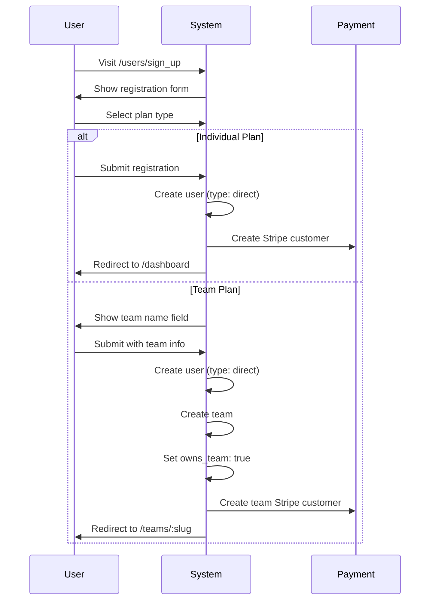
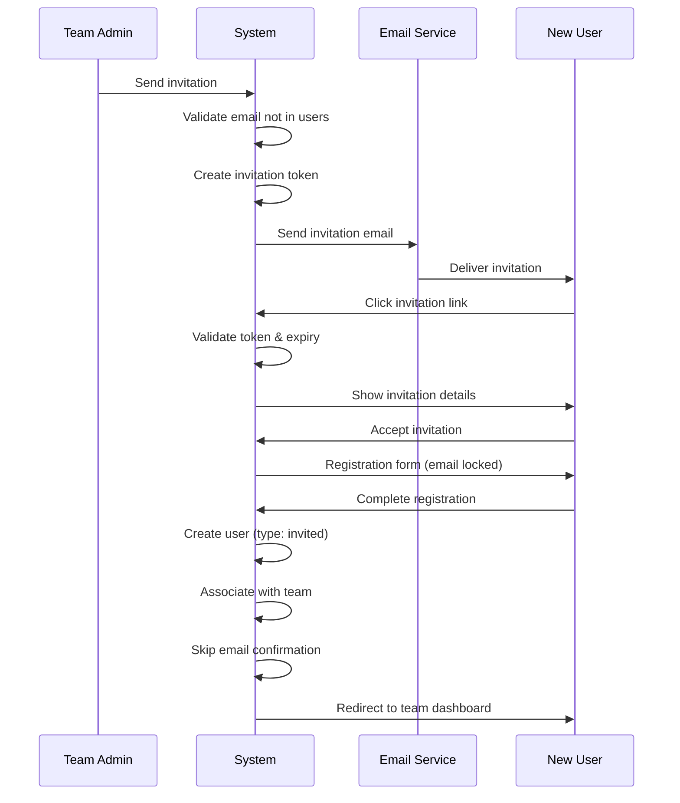
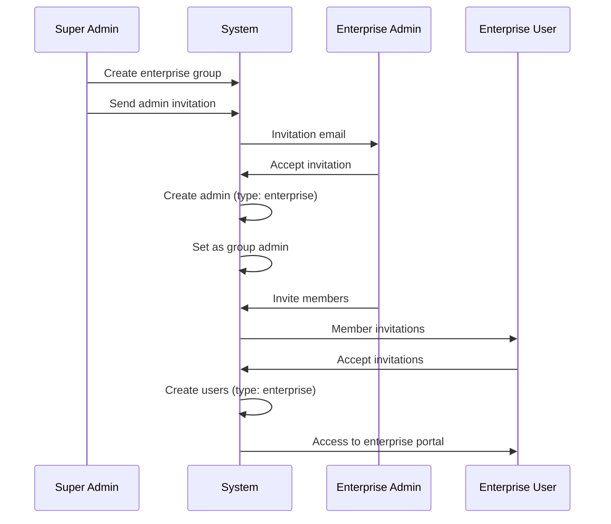

# User Architecture

## Overview

The SaaS Rails Starter Kit implements a sophisticated triple-track user system that provides complete separation between different user types while maintaining a unified authentication system. This architecture enables distinct experiences for individual users, team collaborations, and enterprise organizations.

## Triple-Track User System

### System Design
```mermaid
graph TB
    subgraph "User Types"
        A[Direct Users] --> A1[Personal Billing]
        A --> A2[Can Create Teams]
        A --> A3[Individual Features]
        A --> A4[Subscription Bypass<br/>(if Admin)]
        
        B[Invited Users] --> B1[Team Members Only]
        B --> B2[No Personal Billing]
        B --> B3[Team Features Only]
        B --> B4[Cannot Join Other Teams]
        
        C[Enterprise Users] --> C1[Organization Members]
        C --> C2[Centralized Billing]
        C --> C3[Enterprise Features]
        C --> C4[Purple-Themed UI]
    end
    
    subgraph "System Roles"
        D[Super Admin] --> D1[Platform Owner]
        D --> D2[Complete Access]
        D --> D3[Direct Email Changes]
        
        E[Site Admin] --> E1[Customer Support]
        E --> E2[Limited Admin Access]
        E --> E3[Read-Only Teams/Orgs]
        
        F[Regular User] --> F1[Standard Access]
    end
    
    subgraph "Context Roles"
        G[Team Admin] --> G1[Team Management]
        G --> G2[Billing Control]
        G --> G3[Member Deletion]
        
        H[Team Member] --> H1[Team Access]
        H --> H2[Limited Permissions]
        
        I[Enterprise Admin] --> I1[Org Management]
        I --> I2[Invitation-Based Assignment]
        J[Enterprise Member] --> J1[Org Access]
    end
    
    style C4 fill:#e1bee7,stroke:#4a148c
    style D3 fill:#c8e6c9,stroke:#2e7d32
    style G3 fill:#ffcdd2,stroke:#d32f2f
```

### User Type Definitions

#### 1. Direct Users (`user_type: 'direct'`)
- **Registration**: Public signup with plan selection
- **Billing**: Individual Stripe subscription
- **Features**: Personal dashboard and features
- **Teams**: Can create and own teams
- **Restrictions**: Cannot join teams via invitation

```ruby
# Direct user characteristics
user.direct?               # => true
user.team_id              # => nil (unless owns_team)
user.owns_team            # => true/false
user.stripe_customer_id   # => "cus_xxxxx"
```

#### 2. Invited Users (`user_type: 'invited'`)
- **Registration**: Invitation-only via email
- **Billing**: Shared team billing
- **Features**: Team features only
- **Teams**: Must belong to a team
- **Restrictions**: Cannot have personal billing

```ruby
# Invited user characteristics
user.invited?             # => true
user.team_id             # => 123 (required)
user.team_role           # => 'admin' or 'member'
user.stripe_customer_id  # => nil
```

#### 3. Enterprise Users (`user_type: 'enterprise'`)
- **Registration**: Enterprise invitation only
- **Billing**: Organization-level billing
- **Features**: Enterprise features
- **Organization**: Must belong to enterprise group
- **Restrictions**: No team associations

```ruby
# Enterprise user characteristics
user.enterprise?                    # => true
user.enterprise_group_id           # => 456 (required)
user.enterprise_group_role         # => 'admin' or 'member'
user.team_id                       # => nil (always)
```

## User Roles and Permissions

### System Roles (`system_role`)

#### Super Admin
- **Access**: Complete system control
- **Permissions**:
  - Create/manage teams and enterprise groups
  - Manage all users
  - Access all admin panels
  - Impersonate any user
  - System configuration

#### Site Admin
- **Access**: Customer support functions
- **Permissions**:
  - View user and team information
  - Manage user status (active/inactive/locked)
  - Access support tools
  - Cannot create teams or modify billing
  - Limited impersonation

#### Regular User
- **Access**: Standard user features
- **Permissions**: Based on user type and context roles

### Context Roles

#### Team Roles (`team_role`)
- **Admin**: Full team management rights
- **Member**: Basic team access

#### Enterprise Roles (`enterprise_group_role`)
- **Admin**: Organization management
- **Member**: Organization access

## Registration Flows

### Direct User Registration



### Invited User Registration



### Enterprise User Registration



## User State Management

### User Status States

```ruby
# Status transitions
user.status # => 'active', 'inactive', 'locked'

# State machine rules
active → inactive     # Admin deactivation
active → locked       # Security lockout
inactive → active     # Admin reactivation
locked → active       # Admin unlock
inactive ↛ locked     # Cannot lock inactive
locked ↛ inactive     # Must unlock first

# Activity tracking (async)
TrackUserActivityJob.perform_later(user) # 5-min cache
```

### Authentication States

```ruby
# Devise states
user.confirmed?        # Email verified
user.locked?          # Account locked
user.access_locked?   # Too many failed attempts
user.active_for_authentication? # Can sign in
```

## User Model Implementation

### Core Validations

```ruby
class User < ApplicationRecord
  # Type validations
  validates :user_type, inclusion: { in: %w[direct invited enterprise] }
  
  # Association validations based on type
  validate :user_type_associations_valid
  
  private
  
  def user_type_associations_valid
    case user_type
    when 'direct'
      # Direct users cannot have team associations unless they own the team
      if team_id.present? && !owns_team?
        errors.add(:team_id, "not allowed for direct users unless they own the team")
      end
      if enterprise_group_id.present?
        errors.add(:enterprise_group_id, "not allowed for direct users")
      end
    when 'invited'
      # Invited users must have team associations
      errors.add(:team_id, "required for invited users") if team_id.blank?
      errors.add(:team_role, "required for invited users") if team_role.blank?
      if enterprise_group_id.present?
        errors.add(:enterprise_group_id, "not allowed for invited users")
      end
    when 'enterprise'
      # Enterprise users must have enterprise associations
      errors.add(:enterprise_group_id, "required for enterprise users") if enterprise_group_id.blank?
      errors.add(:enterprise_group_role, "required for enterprise users") if enterprise_group_role.blank?
      if team_id.present?
        errors.add(:team_id, "not allowed for enterprise users")
      end
    end
  end
end
```

### Database Constraints

```sql
-- Enforce user type associations at database level
ALTER TABLE users ADD CONSTRAINT user_type_check CHECK (
  (user_type = 'direct' AND 
   (team_id IS NULL OR owns_team = true) AND 
   team_role IS NULL AND 
   enterprise_group_id IS NULL AND 
   enterprise_group_role IS NULL) OR
   
  (user_type = 'invited' AND 
   team_id IS NOT NULL AND 
   team_role IS NOT NULL AND 
   enterprise_group_id IS NULL AND 
   enterprise_group_role IS NULL AND
   owns_team = false) OR
   
  (user_type = 'enterprise' AND 
   team_id IS NULL AND 
   team_role IS NULL AND 
   enterprise_group_id IS NOT NULL AND 
   enterprise_group_role IS NOT NULL AND
   owns_team = false)
);
```

## Access Control Patterns

### URL Structure by User Type

```ruby
# Direct Users
/dashboard                    # Personal dashboard
/billing                     # Personal billing
/profile                     # Personal profile
/teams/new                   # Create team (if allowed)
/teams/:slug/*               # If owns team

# Invited Users  
/teams/:slug/                # Team dashboard
/teams/:slug/projects        # Team features
/teams/:slug/profile         # Team profile
# No access to /dashboard or /billing

# Enterprise Users
/enterprise/:slug/           # Enterprise dashboard
/enterprise/:slug/members    # Member directory
/enterprise/:slug/resources  # Enterprise resources
# No access to team or individual routes
```

### Controller Authorization

```ruby
class ApplicationController < ActionController::Base
  include Pundit::Authorization
  
  def authorize_direct_user!
    redirect_to root_path unless current_user.direct?
  end
  
  def authorize_team_member!
    redirect_to root_path unless current_user.invited? || 
                                (current_user.direct? && current_user.owns_team?)
  end
  
  def authorize_enterprise_user!
    redirect_to root_path unless current_user.enterprise?
  end
end
```

## User Lifecycle Management

### Account Creation

```ruby
# Service object for user creation
class Users::CreationService
  def create_direct_user(params)
    User.transaction do
      user = User.create!(
        params.merge(
          user_type: 'direct',
          status: 'active'
        )
      )
      
      # Create Stripe customer
      user.set_payment_processor(:stripe)
      user.payment_processor.create_customer
      
      # Send welcome email
      UserMailer.welcome(user).deliver_later
      
      user
    end
  end
  
  def create_from_invitation(invitation, params)
    User.transaction do
      user_attrs = {
        email: invitation.email,
        status: 'active',
        confirmed_at: Time.current, # Skip confirmation
        **params
      }
      
      # Polymorphic invitation handling
      case invitation.invitation_type
      when 'team'
        user_attrs.merge!(
          user_type: 'invited',
          team_id: invitation.invitable_id,
          team_role: invitation.role
        )
      when 'enterprise'
        user_attrs.merge!(
          user_type: 'enterprise',
          enterprise_group_id: invitation.invitable_id,
          enterprise_group_role: invitation.role
        )
        
        # Set as enterprise admin if needed
        if invitation.role == 'admin'
          enterprise_group = invitation.invitable
          enterprise_group.update!(admin_id: user.id) if enterprise_group.admin_id.nil?
        end
      end
      
      user = User.create!(user_attrs)
      invitation.update!(accepted_at: Time.current)
      
      user
    end
  end
end
```

### Account Deactivation

```ruby
class Users::StatusManagementService
  def deactivate_user(user, admin:, reason:)
    user.transaction do
      # Update status
      user.update!(status: 'inactive')
      
      # Invalidate sessions
      user.update_column(:remember_created_at, nil)
      
      # Create audit log
      AuditLog.create!(
        user: admin,
        target_user: user,
        action: 'user.deactivate',
        details: { reason: reason }
      )
      
      # Send notification
      UserMailer.account_deactivated(user).deliver_later
    end
  end
end
```

## Permission Hierarchy

### System-Wide Permissions

```
Super Admin
    ↓ can impersonate/manage
Site Admin  
    ↓ can support/view
Team Admin (context-specific)
    ↓ can manage team
Team Member
    ↓ basic access
Direct User (independent)
```

### Feature Access Matrix

| Feature | Super Admin | Site Admin | Direct User | Team Admin | Team Member | Enterprise Admin | Enterprise Member |
|---------|------------|------------|-------------|------------|-------------|------------------|-------------------|
| System Config | ✅ | ❌ | ❌ | ❌ | ❌ | ❌ | ❌ |
| Create Teams | ✅ | ❌ | ✅ | ❌ | ❌ | ❌ | ❌ |
| User Management | ✅ | View Only | ❌ | Team Only | ❌ | Org Only | ❌ |
| Billing Access | ✅ | View Only | Personal | Team | ❌ | Org | ❌ |
| Impersonation | ✅ | Limited | ❌ | ❌ | ❌ | ❌ | ❌ |
| Audit Logs | ✅ | ✅ | ❌ | Team Only | ❌ | Org Only | ❌ |

## Security Considerations

### User Type Immutability
- User types cannot be changed after creation
- Prevents permission escalation
- Maintains billing integrity

### Invitation Security
- Tokens expire after 7 days
- One-time use only
- Email validation prevents duplicates
- CSRF protection on acceptance
- Polymorphic support for teams and enterprises

### Session Management
- Separate session handling per user type
- Activity tracking for audit trails
- Automatic logout on status change
- Secure cookie configuration
- Background job for activity tracking (5-min intervals)

### Rate Limiting (Rack::Attack)
- Login attempts: 5 per minute per IP
- Password resets: 3 per hour per email
- Registration: 5 per hour per IP
- Invitations: 10 per hour per user
- API requests: 100 per minute per user

## Best Practices

### 1. Always Check User Type
```ruby
# Good
if current_user.direct?
  # Direct user logic
elsif current_user.invited?
  # Team member logic
end

# Bad - assumes user type
if current_user.team_id
  # Could be direct user with team
end
```

### 2. Use Scoped Queries
```ruby
# Good - scoped to user type
scope :direct_users, -> { where(user_type: 'direct') }
scope :team_members, -> { where(user_type: 'invited') }

# Usage
User.direct_users.active
User.team_members.where(team: team)
```

### 3. Validate Associations
```ruby
# Always validate user can access resource
def set_team
  if current_user.direct? && current_user.owns_team?
    @team = current_user.team
  elsif current_user.invited?
    @team = current_user.team
  else
    redirect_to root_path
  end
end
```

## Current State & Known Issues

### Application Health (January 2025)
- **Test Coverage**: 1.33% (Critical - target 90%)
- **User Model Tests**: 42 errors, 34 skips
- **Code Quality**: 253 RuboCop offenses
- **Performance**: Excellent (<100ms response times)

### Known Issues
1. **Site Admin Navigation**: Fixed - was showing unauthorized team creation
2. **Enterprise Creation**: Fixed - circular dependency resolved with invitations
3. **Icon Helper**: Fixed - standardized on `icon` helper
4. **Test Coverage**: Critical - needs immediate attention

## Recent Improvements (January 2025)

### UI/UX Enhancements
1. **Tailwind UI Sidebar**: Light theme with modern navigation
2. **Simplified Navigation**: User-specific items in avatar dropdown
3. **Focus Management**: Keyboard-only focus indicators
4. **Admin Privileges**: Super/site admins bypass subscription requirements
5. **Direct Email Changes**: Super admins can change email without confirmation

### Performance Optimizations
1. **Background Activity Tracking**: Moved from synchronous to async (5-min intervals)
2. **Query Optimization**: Eliminated N+1 queries with eager loading
3. **Caching Strategy**: Model and fragment caching
4. **Pre-calculated Statistics**: Reduced database queries in views

### Security Enhancements
1. **Rack::Attack Integration**: Comprehensive rate limiting
2. **Polymorphic Invitations**: Support for both teams and enterprises
3. **Enhanced Audit Logging**: All admin actions tracked
4. **Improved CSRF Protection**: Updated for Rails 8.0.2

## Future Enhancements

### Planned Features
1. **User Type Migration**: Allow enterprise to team migration
2. **Multi-Team Support**: Users in multiple teams
3. **Guest Users**: Limited access without registration
4. **OAuth Providers**: Social login integration
5. **Two-Factor Authentication**: Enhanced security for admins

### Technical Improvements
1. **GraphQL API**: Better mobile app support
2. **Real-time Presence**: Show online team members
3. **Advanced Permissions**: Granular feature access
4. **Audit Trail UI**: User activity dashboard
5. **Notification System**: Multi-channel delivery via Noticed gem

---

**Last Updated**: January 2025
**Previous**: [System Overview](01-system-overview.md)
**Next**: [Database Design](03-database-design.md)