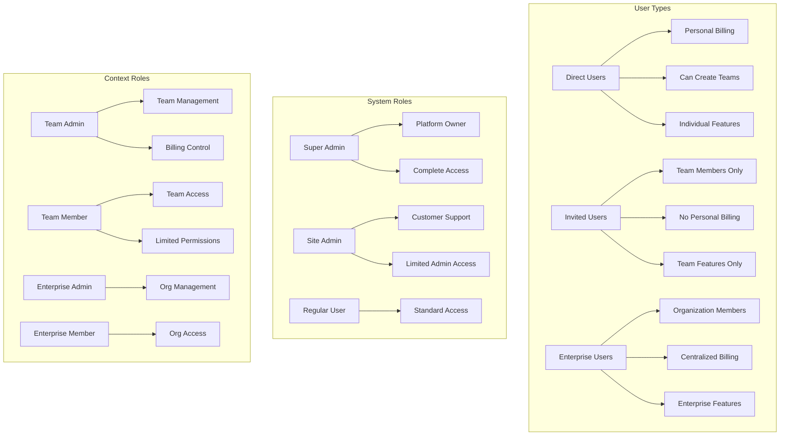

# User Architecture

## Overview

The SaaS Rails Starter Kit implements a sophisticated triple-track user system that provides complete separation between different user types while maintaining a unified authentication system. This architecture enables distinct experiences for individual users, team collaborations, and enterprise organizations.

## Triple-Track User System

### System Design


### User Type Definitions

#### 1. Direct Users (`user_type: 'direct'`)
- **Registration**: Public signup with plan selection
- **Billing**: Individual Stripe subscription
- **Features**: Personal dashboard and features
- **Teams**: Can create and own teams
- **Restrictions**: Cannot join teams via invitation

```ruby
# Direct user characteristics
user.direct?               # => true
user.team_id              # => nil (unless owns_team)
user.owns_team            # => true/false
user.stripe_customer_id   # => "cus_xxxxx"
```

#### 2. Invited Users (`user_type: 'invited'`)
- **Registration**: Invitation-only via email
- **Billing**: Shared team billing
- **Features**: Team features only
- **Teams**: Must belong to a team
- **Restrictions**: Cannot have personal billing

```ruby
# Invited user characteristics
user.invited?             # => true
user.team_id             # => 123 (required)
user.team_role           # => 'admin' or 'member'
user.stripe_customer_id  # => nil
```

#### 3. Enterprise Users (`user_type: 'enterprise'`)
- **Registration**: Enterprise invitation only
- **Billing**: Organization-level billing
- **Features**: Enterprise features
- **Organization**: Must belong to enterprise group
- **Restrictions**: No team associations

```ruby
# Enterprise user characteristics
user.enterprise?                    # => true
user.enterprise_group_id           # => 456 (required)
user.enterprise_group_role         # => 'admin' or 'member'
user.team_id                       # => nil (always)
```

## User Roles and Permissions

### System Roles (`system_role`)

#### Super Admin
- **Access**: Complete system control
- **Permissions**:
  - Create/manage teams and enterprise groups
  - Manage all users
  - Access all admin panels
  - Impersonate any user
  - System configuration

#### Site Admin
- **Access**: Customer support functions
- **Permissions**:
  - View user and team information
  - Manage user status (active/inactive/locked)
  - Access support tools
  - Cannot create teams or modify billing
  - Limited impersonation

#### Regular User
- **Access**: Standard user features
- **Permissions**: Based on user type and context roles

### Context Roles

#### Team Roles (`team_role`)
- **Admin**: Full team management rights
- **Member**: Basic team access

#### Enterprise Roles (`enterprise_group_role`)
- **Admin**: Organization management
- **Member**: Organization access

## Registration Flows

### Direct User Registration


### Invited User Registration


### Enterprise User Registration


## User State Management

### User Status States

```ruby
# Status transitions
user.status # => 'active', 'inactive', 'locked'

# State machine rules
active → inactive     # Admin deactivation
active → locked       # Security lockout
inactive → active     # Admin reactivation
locked → active       # Admin unlock
inactive ↛ locked     # Cannot lock inactive
locked ↛ inactive     # Must unlock first
```

### Authentication States

```ruby
# Devise states
user.confirmed?        # Email verified
user.locked?          # Account locked
user.access_locked?   # Too many failed attempts
user.active_for_authentication? # Can sign in
```

## User Model Implementation

### Core Validations

```ruby
class User < ApplicationRecord
  # Type validations
  validates :user_type, inclusion: { in: %w[direct invited enterprise] }
  
  # Association validations based on type
  validate :user_type_associations_valid
  
  private
  
  def user_type_associations_valid
    case user_type
    when 'direct'
      # Direct users cannot have team associations unless they own the team
      if team_id.present? && !owns_team?
        errors.add(:team_id, "not allowed for direct users unless they own the team")
      end
      if enterprise_group_id.present?
        errors.add(:enterprise_group_id, "not allowed for direct users")
      end
    when 'invited'
      # Invited users must have team associations
      errors.add(:team_id, "required for invited users") if team_id.blank?
      errors.add(:team_role, "required for invited users") if team_role.blank?
      if enterprise_group_id.present?
        errors.add(:enterprise_group_id, "not allowed for invited users")
      end
    when 'enterprise'
      # Enterprise users must have enterprise associations
      errors.add(:enterprise_group_id, "required for enterprise users") if enterprise_group_id.blank?
      errors.add(:enterprise_group_role, "required for enterprise users") if enterprise_group_role.blank?
      if team_id.present?
        errors.add(:team_id, "not allowed for enterprise users")
      end
    end
  end
end
```

### Database Constraints

```sql
-- Enforce user type associations at database level
ALTER TABLE users ADD CONSTRAINT user_type_check CHECK (
  (user_type = 'direct' AND 
   (team_id IS NULL OR owns_team = true) AND 
   team_role IS NULL AND 
   enterprise_group_id IS NULL AND 
   enterprise_group_role IS NULL) OR
   
  (user_type = 'invited' AND 
   team_id IS NOT NULL AND 
   team_role IS NOT NULL AND 
   enterprise_group_id IS NULL AND 
   enterprise_group_role IS NULL AND
   owns_team = false) OR
   
  (user_type = 'enterprise' AND 
   team_id IS NULL AND 
   team_role IS NULL AND 
   enterprise_group_id IS NOT NULL AND 
   enterprise_group_role IS NOT NULL AND
   owns_team = false)
);
```

## Access Control Patterns

### URL Structure by User Type

```ruby
# Direct Users
/dashboard                    # Personal dashboard
/billing                     # Personal billing
/profile                     # Personal profile
/teams/new                   # Create team (if allowed)
/teams/:slug/*               # If owns team

# Invited Users  
/teams/:slug/                # Team dashboard
/teams/:slug/projects        # Team features
/teams/:slug/profile         # Team profile
# No access to /dashboard or /billing

# Enterprise Users
/enterprise/:slug/           # Enterprise dashboard
/enterprise/:slug/members    # Member directory
/enterprise/:slug/resources  # Enterprise resources
# No access to team or individual routes
```

### Controller Authorization

```ruby
class ApplicationController < ActionController::Base
  include Pundit::Authorization
  
  def authorize_direct_user!
    redirect_to root_path unless current_user.direct?
  end
  
  def authorize_team_member!
    redirect_to root_path unless current_user.invited? || 
                                (current_user.direct? && current_user.owns_team?)
  end
  
  def authorize_enterprise_user!
    redirect_to root_path unless current_user.enterprise?
  end
end
```

## User Lifecycle Management

### Account Creation

```ruby
# Service object for user creation
class Users::CreationService
  def create_direct_user(params)
    User.transaction do
      user = User.create!(
        params.merge(
          user_type: 'direct',
          status: 'active'
        )
      )
      
      # Create Stripe customer
      user.set_payment_processor(:stripe)
      user.payment_processor.create_customer
      
      # Send welcome email
      UserMailer.welcome(user).deliver_later
      
      user
    end
  end
  
  def create_from_invitation(invitation, params)
    User.transaction do
      user = User.create!(
        email: invitation.email,
        user_type: invitation.invitation_type == 'team' ? 'invited' : 'enterprise',
        team_id: invitation.team_id,
        team_role: invitation.role,
        enterprise_group_id: invitation.invitable_id,
        enterprise_group_role: invitation.role,
        status: 'active',
        confirmed_at: Time.current, # Skip confirmation
        **params
      )
      
      invitation.update!(accepted_at: Time.current)
      
      user
    end
  end
end
```

### Account Deactivation

```ruby
class Users::StatusManagementService
  def deactivate_user(user, admin:, reason:)
    user.transaction do
      # Update status
      user.update!(status: 'inactive')
      
      # Invalidate sessions
      user.update_column(:remember_created_at, nil)
      
      # Create audit log
      AuditLog.create!(
        user: admin,
        target_user: user,
        action: 'user.deactivate',
        details: { reason: reason }
      )
      
      # Send notification
      UserMailer.account_deactivated(user).deliver_later
    end
  end
end
```

## Permission Hierarchy

### System-Wide Permissions

```
Super Admin
    ↓ can impersonate/manage
Site Admin  
    ↓ can support/view
Team Admin (context-specific)
    ↓ can manage team
Team Member
    ↓ basic access
Direct User (independent)
```

### Feature Access Matrix

| Feature | Super Admin | Site Admin | Direct User | Team Admin | Team Member | Enterprise Admin | Enterprise Member |
|---------|------------|------------|-------------|------------|-------------|------------------|-------------------|
| System Config | ✅ | ❌ | ❌ | ❌ | ❌ | ❌ | ❌ |
| Create Teams | ✅ | ❌ | ✅ | ❌ | ❌ | ❌ | ❌ |
| User Management | ✅ | View Only | ❌ | Team Only | ❌ | Org Only | ❌ |
| Billing Access | ✅ | View Only | Personal | Team | ❌ | Org | ❌ |
| Impersonation | ✅ | Limited | ❌ | ❌ | ❌ | ❌ | ❌ |
| Audit Logs | ✅ | ✅ | ❌ | Team Only | ❌ | Org Only | ❌ |

## Security Considerations

### User Type Immutability
- User types cannot be changed after creation
- Prevents permission escalation
- Maintains billing integrity

### Invitation Security
- Tokens expire after 7 days
- One-time use only
- Email validation prevents duplicates
- CSRF protection on acceptance

### Session Management
- Separate session handling per user type
- Activity tracking for audit trails
- Automatic logout on status change
- Secure cookie configuration

## Best Practices

### 1. Always Check User Type
```ruby
# Good
if current_user.direct?
  # Direct user logic
elsif current_user.invited?
  # Team member logic
end

# Bad - assumes user type
if current_user.team_id
  # Could be direct user with team
end
```

### 2. Use Scoped Queries
```ruby
# Good - scoped to user type
scope :direct_users, -> { where(user_type: 'direct') }
scope :team_members, -> { where(user_type: 'invited') }

# Usage
User.direct_users.active
User.team_members.where(team: team)
```

### 3. Validate Associations
```ruby
# Always validate user can access resource
def set_team
  if current_user.direct? && current_user.owns_team?
    @team = current_user.team
  elsif current_user.invited?
    @team = current_user.team
  else
    redirect_to root_path
  end
end
```

## Future Enhancements

### Planned Features
1. **User Type Migration**: Allow enterprise to team migration
2. **Multi-Team Support**: Users in multiple teams
3. **Guest Users**: Limited access without registration
4. **OAuth Providers**: Social login integration

### Technical Improvements
1. **GraphQL API**: Better mobile app support
2. **Real-time Presence**: Show online team members
3. **Advanced Permissions**: Granular feature access
4. **Audit Trail UI**: User activity dashboard

---

**Last Updated**: June 2025
**Previous**: [System Overview](01-system-overview.md)
**Next**: [Database Design](03-database-design.md)