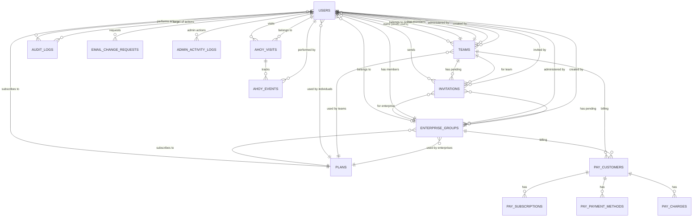

# Database Design

## Overview

The database architecture is designed to support a multi-tenant SaaS application with strict data isolation, referential integrity, and performance optimization. The schema enforces business rules at the database level while maintaining flexibility for future growth.

## Core Design Principles

### 1. Data Integrity First
- **Foreign key constraints** for all relationships
- **Check constraints** for business rules
- **Unique indexes** for data consistency
- **NOT NULL constraints** where appropriate

### 2. Performance by Design
- **Proper indexing** on all foreign keys and search fields
- **Composite indexes** for common query patterns
- **Partial indexes** for filtered queries
- **Counter caches** for association counts

### 3. Scalability Considerations
- **UUID support** for distributed systems (future)
- **Timestamp tracking** for all records
- **Soft deletes** where appropriate
- **Partitioning ready** schema design

### 4. Security at the Data Layer
- **Encrypted columns** for sensitive data
- **Audit trails** for critical changes
- **Row-level security** preparation
- **Data masking** capabilities

## Entity Relationship Diagram



## Core Tables

### users
Primary table for all user accounts with polymorphic behavior based on user_type.

```sql
CREATE TABLE users (
  id BIGSERIAL PRIMARY KEY,
  
  -- Authentication (Devise)
  email VARCHAR(255) NOT NULL,
  encrypted_password VARCHAR(255) NOT NULL,
  reset_password_token VARCHAR(255),
  reset_password_sent_at TIMESTAMP,
  remember_created_at TIMESTAMP,
  confirmation_token VARCHAR(255),
  confirmed_at TIMESTAMP,
  confirmation_sent_at TIMESTAMP,
  unconfirmed_email VARCHAR(255),
  
  -- Lockable
  failed_attempts INTEGER DEFAULT 0,
  unlock_token VARCHAR(255),
  locked_at TIMESTAMP,
  
  -- Trackable
  sign_in_count INTEGER DEFAULT 0,
  current_sign_in_at TIMESTAMP,
  last_sign_in_at TIMESTAMP,
  current_sign_in_ip INET,
  last_sign_in_ip INET,
  
  -- User Identity
  first_name VARCHAR(255),
  last_name VARCHAR(255),
  
  -- System Classification
  system_role INTEGER DEFAULT 0, -- 0: user, 1: site_admin, 2: super_admin
  user_type INTEGER DEFAULT 0,   -- 0: direct, 1: invited, 2: enterprise
  status INTEGER DEFAULT 0,      -- 0: active, 1: inactive, 2: locked
  
  -- Team Association (conditional)
  team_id BIGINT REFERENCES teams(id),
  team_role INTEGER,             -- 0: member, 1: admin
  owns_team BOOLEAN DEFAULT FALSE,
  
  -- Enterprise Association (conditional)
  enterprise_group_id BIGINT REFERENCES enterprise_groups(id),
  enterprise_group_role INTEGER, -- 0: member, 1: admin
  
  -- Individual Billing (direct users only)
  stripe_customer_id VARCHAR(255),
  
  -- Activity Tracking
  last_activity_at TIMESTAMP,
  
  -- Metadata
  created_at TIMESTAMP NOT NULL,
  updated_at TIMESTAMP NOT NULL,
  
  -- Indexes
  CONSTRAINT idx_users_email UNIQUE (email),
  INDEX idx_users_system_role (system_role),
  INDEX idx_users_user_type (user_type),
  INDEX idx_users_status (status),
  INDEX idx_users_team_id (team_id),
  INDEX idx_users_enterprise_group_id (enterprise_group_id),
  INDEX idx_users_last_activity (last_activity_at),
  
  -- Constraints
  CONSTRAINT user_type_associations_check CHECK (
    (user_type = 0 AND 
     (team_id IS NULL OR owns_team = true) AND 
     enterprise_group_id IS NULL) OR
    (user_type = 1 AND 
     team_id IS NOT NULL AND 
     team_role IS NOT NULL AND 
     enterprise_group_id IS NULL AND
     owns_team = false) OR
    (user_type = 2 AND 
     team_id IS NULL AND 
     enterprise_group_id IS NOT NULL AND 
     enterprise_group_role IS NOT NULL AND
     owns_team = false)
  )
);
```

### teams
Multi-tenant team management with subscription handling.

```sql
CREATE TABLE teams (
  id BIGSERIAL PRIMARY KEY,
  
  -- Identity
  name VARCHAR(255) NOT NULL,
  slug VARCHAR(255) NOT NULL,
  
  -- Management
  admin_id BIGINT NOT NULL REFERENCES users(id),
  created_by_id BIGINT NOT NULL REFERENCES users(id),
  
  -- Subscription
  plan INTEGER DEFAULT 0,        -- 0: starter, 1: pro, 2: enterprise
  status INTEGER DEFAULT 0,      -- 0: active, 1: suspended, 2: cancelled
  stripe_customer_id VARCHAR(255),
  stripe_subscription_id VARCHAR(255),
  trial_ends_at TIMESTAMP,
  current_period_end TIMESTAMP,
  
  -- Limits & Configuration
  max_members INTEGER DEFAULT 5,
  settings JSONB DEFAULT '{}',
  custom_domain VARCHAR(255),
  
  -- Metadata
  created_at TIMESTAMP NOT NULL,
  updated_at TIMESTAMP NOT NULL,
  
  -- Indexes
  CONSTRAINT idx_teams_slug UNIQUE (slug),
  INDEX idx_teams_admin_id (admin_id),
  INDEX idx_teams_status (status),
  INDEX idx_teams_plan (plan),
  INDEX idx_teams_trial_ends (trial_ends_at)
);
```

### enterprise_groups
Enterprise organization management with custom billing.

```sql
CREATE TABLE enterprise_groups (
  id BIGSERIAL PRIMARY KEY,
  
  -- Identity
  name VARCHAR(255) NOT NULL,
  slug VARCHAR(255) NOT NULL,
  
  -- Management
  admin_id BIGINT REFERENCES users(id),
  created_by_id BIGINT NOT NULL REFERENCES users(id),
  
  -- Subscription
  plan_id BIGINT NOT NULL REFERENCES plans(id),
  status INTEGER DEFAULT 0,      -- 0: active, 1: suspended, 2: cancelled
  stripe_customer_id VARCHAR(255),
  stripe_subscription_id VARCHAR(255),
  trial_ends_at TIMESTAMP,
  current_period_end TIMESTAMP,
  
  -- Configuration
  max_members INTEGER DEFAULT 100,
  settings JSONB DEFAULT '{}',
  custom_domain VARCHAR(255),
  
  -- Contact Information
  contact_email VARCHAR(255),
  contact_phone VARCHAR(50),
  billing_address TEXT,
  
  -- Metadata
  created_at TIMESTAMP NOT NULL,
  updated_at TIMESTAMP NOT NULL,
  
  -- Indexes
  CONSTRAINT idx_enterprise_groups_slug UNIQUE (slug),
  INDEX idx_enterprise_groups_admin_id (admin_id),
  INDEX idx_enterprise_groups_status (status),
  INDEX idx_enterprise_groups_plan_id (plan_id)
);
```

### invitations
Polymorphic invitation system for teams and enterprise groups.

```sql
CREATE TABLE invitations (
  id BIGSERIAL PRIMARY KEY,
  
  -- Legacy team support
  team_id BIGINT REFERENCES teams(id),
  
  -- Polymorphic association
  invitable_type VARCHAR(255),
  invitable_id BIGINT,
  invitation_type INTEGER DEFAULT 0, -- 0: team, 1: enterprise
  
  -- Invitation Details
  email VARCHAR(255) NOT NULL,
  role INTEGER DEFAULT 0,        -- 0: member, 1: admin
  token VARCHAR(255) NOT NULL,
  invited_by_id BIGINT NOT NULL REFERENCES users(id),
  
  -- Status
  accepted_at TIMESTAMP,
  expires_at TIMESTAMP NOT NULL,
  
  -- Metadata
  created_at TIMESTAMP NOT NULL,
  updated_at TIMESTAMP NOT NULL,
  
  -- Indexes
  CONSTRAINT idx_invitations_token UNIQUE (token),
  INDEX idx_invitations_email (email),
  INDEX idx_invitations_invitable (invitable_type, invitable_id),
  INDEX idx_invitations_team_id (team_id),
  INDEX idx_invitations_expires_at (expires_at),
  INDEX idx_invitations_accepted_at (accepted_at),
  
  -- Constraints
  CONSTRAINT email_not_existing_user CHECK (
    NOT EXISTS (
      SELECT 1 FROM users 
      WHERE LOWER(users.email) = LOWER(invitations.email)
    )
  )
);
```

### plans
Subscription plan definitions for all user types.

```sql
CREATE TABLE plans (
  id BIGSERIAL PRIMARY KEY,
  
  -- Plan Identity
  name VARCHAR(255) NOT NULL,
  plan_segment INTEGER NOT NULL, -- 0: individual, 1: team, 2: enterprise
  
  -- Pricing
  stripe_price_id VARCHAR(255),
  stripe_product_id VARCHAR(255),
  amount_cents INTEGER DEFAULT 0,
  currency VARCHAR(3) DEFAULT 'USD',
  interval INTEGER,              -- 0: month, 1: year
  
  -- Limits & Features
  max_team_members INTEGER,
  features JSONB DEFAULT '[]',
  
  -- Configuration
  active BOOLEAN DEFAULT true,
  public_signup BOOLEAN DEFAULT true,
  contact_sales BOOLEAN DEFAULT false,
  
  -- Metadata
  created_at TIMESTAMP NOT NULL,
  updated_at TIMESTAMP NOT NULL,
  
  -- Indexes
  INDEX idx_plans_segment (plan_segment),
  INDEX idx_plans_active (active),
  INDEX idx_plans_stripe_price (stripe_price_id)
);
```

## Audit & Logging Tables

### audit_logs
Comprehensive audit trail for all critical user actions.

```sql
CREATE TABLE audit_logs (
  id BIGSERIAL PRIMARY KEY,
  
  -- Actors
  user_id BIGINT NOT NULL REFERENCES users(id),
  target_user_id BIGINT NOT NULL REFERENCES users(id),
  
  -- Action Details
  action VARCHAR(100) NOT NULL,
  details JSONB DEFAULT '{}',
  
  -- Context
  ip_address INET,
  user_agent TEXT,
  request_id VARCHAR(255),
  
  -- Metadata
  created_at TIMESTAMP NOT NULL,
  
  -- Indexes
  INDEX idx_audit_logs_user_id (user_id),
  INDEX idx_audit_logs_target_user_id (target_user_id),
  INDEX idx_audit_logs_action (action),
  INDEX idx_audit_logs_created_at (created_at),
  INDEX idx_audit_logs_ip_address (ip_address)
);
```

### admin_activity_logs
Detailed logging of admin panel actions.

```sql
CREATE TABLE admin_activity_logs (
  id BIGSERIAL PRIMARY KEY,
  
  -- Admin User
  admin_user_id BIGINT NOT NULL REFERENCES users(id),
  
  -- Request Details
  controller VARCHAR(255) NOT NULL,
  action VARCHAR(255) NOT NULL,
  method VARCHAR(10) NOT NULL,
  path TEXT NOT NULL,
  params TEXT,
  
  -- Context
  ip_address INET,
  user_agent TEXT,
  
  -- Timing
  timestamp TIMESTAMP NOT NULL,
  response_time_ms INTEGER,
  
  -- Metadata
  created_at TIMESTAMP NOT NULL,
  updated_at TIMESTAMP NOT NULL,
  
  -- Indexes
  INDEX idx_admin_logs_admin_user (admin_user_id),
  INDEX idx_admin_logs_controller_action (controller, action),
  INDEX idx_admin_logs_timestamp (timestamp),
  INDEX idx_admin_logs_ip (ip_address)
);
```

## Payment Tables (via Pay gem)

### pay_customers
Polymorphic customer records for Stripe integration.

```sql
CREATE TABLE pay_customers (
  id BIGSERIAL PRIMARY KEY,
  
  -- Polymorphic owner
  owner_type VARCHAR(255) NOT NULL,
  owner_id BIGINT NOT NULL,
  
  -- Processor Details
  processor VARCHAR(50) NOT NULL,
  processor_id VARCHAR(255),
  
  -- Customer Data
  data JSONB DEFAULT '{}',
  deleted_at TIMESTAMP,
  default BOOLEAN DEFAULT true,
  
  -- Metadata
  created_at TIMESTAMP NOT NULL,
  updated_at TIMESTAMP NOT NULL,
  
  -- Indexes
  INDEX idx_pay_customers_owner (owner_type, owner_id),
  INDEX idx_pay_customers_processor (processor, processor_id),
  INDEX idx_pay_customers_default (owner_type, owner_id, deleted_at, default)
);
```

### pay_subscriptions
Active subscription tracking.

```sql
CREATE TABLE pay_subscriptions (
  id BIGSERIAL PRIMARY KEY,
  
  -- Association
  customer_id BIGINT NOT NULL REFERENCES pay_customers(id),
  
  -- Subscription Details
  name VARCHAR(255) NOT NULL,
  processor_id VARCHAR(255) NOT NULL,
  processor_plan VARCHAR(255),
  quantity INTEGER DEFAULT 1,
  status VARCHAR(50),
  
  -- Billing Cycle
  current_period_start TIMESTAMP,
  current_period_end TIMESTAMP,
  trial_ends_at TIMESTAMP,
  ends_at TIMESTAMP,
  
  -- Metadata
  application_fee_percent DECIMAL(8,2),
  metadata JSONB DEFAULT '{}',
  data JSONB DEFAULT '{}',
  
  -- Timestamps
  created_at TIMESTAMP NOT NULL,
  updated_at TIMESTAMP NOT NULL,
  
  -- Indexes
  INDEX idx_pay_subscriptions_customer (customer_id),
  INDEX idx_pay_subscriptions_processor (processor_id)
);
```

## Analytics Tables (via Ahoy)

### ahoy_visits
User visit tracking for analytics.

```sql
CREATE TABLE ahoy_visits (
  id BIGSERIAL PRIMARY KEY,
  
  -- Tokens
  visit_token VARCHAR(255),
  visitor_token VARCHAR(255),
  
  -- User Association
  user_id BIGINT REFERENCES users(id),
  
  -- Visit Details
  ip VARCHAR(255),
  user_agent TEXT,
  referrer TEXT,
  referring_domain VARCHAR(255),
  landing_page TEXT,
  
  -- Browser/Device Info
  browser VARCHAR(255),
  os VARCHAR(255),
  device_type VARCHAR(255),
  
  -- Location
  country VARCHAR(255),
  region VARCHAR(255),
  city VARCHAR(255),
  latitude DECIMAL(10,8),
  longitude DECIMAL(11,8),
  
  -- UTM Parameters
  utm_source VARCHAR(255),
  utm_medium VARCHAR(255),
  utm_term VARCHAR(255),
  utm_content VARCHAR(255),
  utm_campaign VARCHAR(255),
  
  -- Timing
  started_at TIMESTAMP,
  
  -- Metadata
  created_at TIMESTAMP NOT NULL,
  updated_at TIMESTAMP NOT NULL,
  
  -- Indexes
  INDEX idx_ahoy_visits_user (user_id),
  INDEX idx_ahoy_visits_visit_token (visit_token),
  INDEX idx_ahoy_visits_started_at (started_at)
);
```

## Database Optimization

### Indexing Strategy

#### Primary Indexes
- All primary keys have clustered indexes
- Foreign keys have non-clustered indexes
- Unique constraints create unique indexes

#### Composite Indexes
```sql
-- Common query patterns
CREATE INDEX idx_users_type_status ON users(user_type, status);
CREATE INDEX idx_invitations_email_team ON invitations(email, team_id);
CREATE INDEX idx_audit_logs_user_action_date ON audit_logs(user_id, action, created_at);
```

#### Partial Indexes
```sql
-- Active records only
CREATE INDEX idx_users_active ON users(id) WHERE status = 0;
CREATE INDEX idx_teams_active ON teams(id) WHERE status = 0;
CREATE INDEX idx_invitations_pending ON invitations(id) WHERE accepted_at IS NULL;
```

### Query Optimization

#### N+1 Prevention
```ruby
# Bad - N+1 queries
teams = Team.all
teams.each { |team| puts team.users.count }

# Good - includes association
teams = Team.includes(:users).all
teams.each { |team| puts team.users.size }

# Better - counter cache
# Add users_count column to teams table
teams = Team.all
teams.each { |team| puts team.users_count }
```

#### Efficient Scopes
```ruby
class User < ApplicationRecord
  # Use database for filtering
  scope :active, -> { where(status: 'active') }
  scope :with_teams, -> { joins(:team).distinct }
  
  # Avoid loading all records
  scope :recent, -> { order(created_at: :desc).limit(10) }
end
```

## Data Integrity

### Foreign Key Constraints
```sql
-- Cascading deletes where appropriate
ALTER TABLE invitations 
  ADD CONSTRAINT fk_invitations_team 
  FOREIGN KEY (team_id) 
  REFERENCES teams(id) 
  ON DELETE CASCADE;

-- Restrict deletes to prevent orphans
ALTER TABLE users 
  ADD CONSTRAINT fk_users_team 
  FOREIGN KEY (team_id) 
  REFERENCES teams(id) 
  ON DELETE RESTRICT;
```

### Check Constraints
```sql
-- Business rule enforcement
ALTER TABLE users ADD CONSTRAINT email_format 
  CHECK (email ~* '^[A-Za-z0-9._%+-]+@[A-Za-z0-9.-]+\.[A-Za-z]{2,}$');

ALTER TABLE teams ADD CONSTRAINT positive_max_members 
  CHECK (max_members > 0);

ALTER TABLE invitations ADD CONSTRAINT future_expiry 
  CHECK (expires_at > created_at);
```

### Triggers
```sql
-- Auto-update timestamps
CREATE OR REPLACE FUNCTION update_updated_at_column()
RETURNS TRIGGER AS $$
BEGIN
  NEW.updated_at = CURRENT_TIMESTAMP;
  RETURN NEW;
END;
$$ language 'plpgsql';

CREATE TRIGGER update_users_updated_at 
  BEFORE UPDATE ON users 
  FOR EACH ROW 
  EXECUTE FUNCTION update_updated_at_column();
```

## Migration Best Practices

### Safe Migrations
```ruby
class AddIndexToUsersEmail < ActiveRecord::Migration[7.0]
  disable_ddl_transaction! # For concurrent index creation
  
  def change
    add_index :users, :email, 
              algorithm: :concurrently, 
              if_not_exists: true
  end
end
```

### Data Migrations
```ruby
class BackfillUserTypes < ActiveRecord::Migration[7.0]
  def up
    # Batch updates to avoid locking
    User.where(user_type: nil).find_in_batches do |users|
      users.each do |user|
        user.update_column(:user_type, determine_user_type(user))
      end
    end
  end
  
  private
  
  def determine_user_type(user)
    return 'invited' if user.team_id.present?
    return 'enterprise' if user.enterprise_group_id.present?
    'direct'
  end
end
```

## Performance Monitoring

### Slow Query Detection
```ruby
# config/database.yml
production:
  variables:
    log_min_duration_statement: 500 # Log queries over 500ms
```

### Query Analysis
```sql
-- Explain query plan
EXPLAIN ANALYZE
SELECT u.*, t.name as team_name
FROM users u
LEFT JOIN teams t ON u.team_id = t.id
WHERE u.status = 0
ORDER BY u.created_at DESC
LIMIT 20;
```

## Backup and Recovery

### Backup Strategy
- **Daily backups** with 30-day retention
- **Point-in-time recovery** enabled
- **Cross-region replication** for disaster recovery
- **Encrypted backups** at rest and in transit

### Recovery Procedures
1. Identify recovery point
2. Restore to staging first
3. Validate data integrity
4. Perform production restore
5. Update DNS if needed

## Future Considerations

### Scaling Preparations
1. **UUID Migration**: Prepare for distributed systems
2. **Sharding Strategy**: By team_id or enterprise_group_id
3. **Read Replicas**: Separate read/write workloads
4. **Partitioning**: Time-based for audit logs

### Schema Evolution
1. **Event Sourcing**: For complex state tracking
2. **JSONB Expansion**: More flexible data storage
3. **Full-Text Search**: PostgreSQL FTS integration
4. **Time-Series Data**: For advanced analytics

---

**Last Updated**: June 2025
**Previous**: [User Architecture](02-user-architecture.md)
**Next**: [Authentication & Authorization](04-authentication.md)