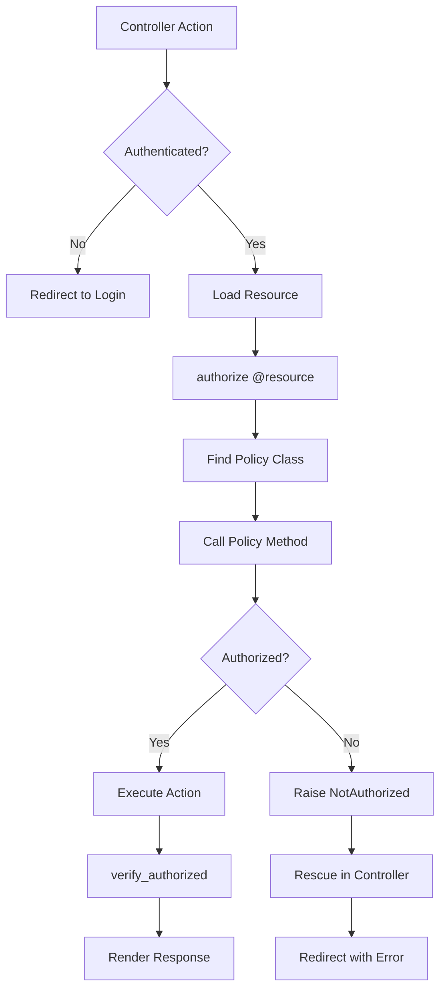

# Authentication & Authorization Architecture

## Overview

The application implements a comprehensive security architecture using Devise for authentication and Pundit for authorization. This dual-layer approach provides flexible, maintainable, and secure access control throughout the system.

## Authentication Architecture (Devise)

### Devise Configuration

The application uses 8 Devise modules for comprehensive authentication:

```ruby
class User < ApplicationRecord
  devise :database_authenticatable,  # Password-based authentication
         :registerable,             # User registration
         :recoverable,              # Password reset functionality
         :rememberable,             # Remember me cookies
         :validatable,              # Email/password validation
         :confirmable,              # Email confirmation
         :trackable,                # Sign-in tracking
         :lockable                  # Account locking
end
```

### Authentication Flow


### Password Security

#### Password Requirements
```ruby
# Strong password validation
def password_complexity
  return if password.blank?
  
  errors.add :password, "must be at least 8 characters" if password.length < 8
  errors.add :password, "must include uppercase letter" unless password.match?(/[A-Z]/)
  errors.add :password, "must include lowercase letter" unless password.match?(/[a-z]/)
  errors.add :password, "must include number" unless password.match?(/[0-9]/)
  errors.add :password, "must include special character" unless password.match?(/[^A-Za-z0-9]/)
end
```

#### Password Storage
- Bcrypt encryption with cost factor 12
- Salted hashes stored in database
- No password history (future enhancement)

### Session Management

#### Session Configuration
```ruby
# config/initializers/session_store.rb
Rails.application.config.session_store :active_record_store,
  key: '_saas_session',
  secure: Rails.env.production?,
  httponly: true,
  same_site: :lax,
  expire_after: 24.hours
```

#### Session Security Features
- **Secure cookies** in production (HTTPS only)
- **HTTPOnly** flag prevents JavaScript access
- **SameSite** protection against CSRF
- **Session rotation** on privilege elevation
- **Activity timeout** after 24 hours

### Account Security Features

#### Email Confirmation
```ruby
# Required before first sign-in
class User < ApplicationRecord
  # Skip confirmation for invited users
  after_create :skip_confirmation_for_invited_users
  
  private
  
  def skip_confirmation_for_invited_users
    confirm if invited? || enterprise?
  end
end
```

#### Account Locking
```ruby
# config/initializers/devise.rb
config.lock_strategy = :failed_attempts
config.unlock_keys = [:email]
config.unlock_strategy = :email
config.maximum_attempts = 5
config.unlock_in = 1.hour
```

#### Login Tracking
```ruby
# Devise trackable provides:
# - sign_in_count
# - current_sign_in_at / last_sign_in_at
# - current_sign_in_ip / last_sign_in_ip

# Enhanced tracking via callbacks
after_sign_in do |user|
  AuditLog.create!(
    user: user,
    action: 'user.login',
    ip_address: request.remote_ip,
    user_agent: request.user_agent
  )
end
```

## Authorization Architecture (Pundit)

### Policy-Based Authorization

```ruby
class ApplicationPolicy
  attr_reader :user, :record

  def initialize(user, record)
    @user = user
    @record = record
  end

  # Helper methods available to all policies
  def super_admin?
    user&.system_role == 'super_admin'
  end

  def site_admin?
    user&.system_role == 'site_admin'
  end

  def admin?
    super_admin? || site_admin?
  end

  def active_user?
    user&.status == 'active'
  end
end
```

### Authorization Flow



### Policy Examples

#### User Policy
```ruby
class UserPolicy < ApplicationPolicy
  # Viewing permissions
  def show?
    # Admins can view anyone
    return true if admin?
    # Users can view themselves
    user == record
  end

  # Modification permissions
  def update?
    # Super admins can update anyone
    return true if super_admin?
    # Site admins cannot update super admins
    return false if record.super_admin? && site_admin?
    # Users can update themselves
    user == record
  end

  def destroy?
    # Only super admins can delete users
    return true if super_admin?
    # Team admins can delete team members
    team_admin_can_delete?
  end

  # Role management
  def change_role?
    super_admin? && user != record
  end

  # Scopes for index actions
  class Scope < Scope
    def resolve
      if user.super_admin?
        scope.all
      elsif user.site_admin?
        scope.where.not(system_role: 'super_admin')
      elsif user.team_admin?
        scope.where(team: user.team)
      else
        scope.none
      end
    end
  end

  private

  def team_admin_can_delete?
    user.team_admin? && 
    record.invited? && 
    user.team_id == record.team_id
  end
end
```

#### Team Policy
```ruby
class TeamPolicy < ApplicationPolicy
  def show?
    # Admins can view any team
    return true if admin?
    # Members can view their team
    user.team_id == record.id
  end

  def create?
    # Only super admins create teams
    super_admin?
  end

  def update?
    # Super admins or team admins
    super_admin? || team_admin?
  end

  def manage_members?
    super_admin? || team_admin?
  end

  def manage_billing?
    super_admin? || (team_admin? && record.admin_id == user.id)
  end

  private

  def team_admin?
    user.team_id == record.id && user.team_role == 'admin'
  end
end
```

### Controller Integration

```ruby
class ApplicationController < ActionController::Base
  include Pundit::Authorization
  
  # Ensure authentication
  before_action :authenticate_user!
  
  # Ensure authorization
  after_action :verify_authorized, except: :index
  after_action :verify_policy_scoped, only: :index
  
  # Handle authorization failures
  rescue_from Pundit::NotAuthorizedError, with: :user_not_authorized
  
  private
  
  def user_not_authorized(exception)
    policy_name = exception.policy.class.to_s.underscore
    error_key = exception.query.to_s.remove('?')
    
    flash[:alert] = t("#{policy_name}.#{error_key}", 
                     scope: "pundit", 
                     default: :default)
    
    redirect_back_or_to(root_path)
  end
end
```

### Advanced Authorization Patterns

#### Context-Aware Policies
```ruby
class ProjectPolicy < ApplicationPolicy
  # Check team context
  def show?
    return true if admin?
    
    # User must be on the same team as the project
    if record.team.present?
      user.team_id == record.team_id
    else
      false
    end
  end

  # Role-based feature access
  def export?
    return true if admin?
    
    # Only team admins can export
    user.team_admin? && user.team_id == record.team_id
  end
end
```

#### Nested Resource Authorization
```ruby
class Teams::MembersController < ApplicationController
  before_action :set_team
  before_action :set_member, only: [:show, :update, :destroy]
  
  def destroy
    # Authorize both team and member
    authorize @team, :manage_members?
    authorize @member, :destroy?
    
    @member.destroy
    redirect_to team_members_path(@team)
  end
  
  private
  
  def set_team
    @team = Team.find_by!(slug: params[:team_slug])
    authorize @team, :show?
  end
  
  def set_member
    @member = @team.users.find(params[:id])
  end
end
```

## Security Middleware

### Warden Configuration
```ruby
# Devise uses Warden for authentication
Warden::Manager.after_authentication do |user, auth, opts|
  # Track successful authentication
  user.update_column(:last_sign_in_at, Time.current)
end

Warden::Manager.before_failure do |env, opts|
  # Log failed authentication attempts
  email = env['rack.request.form_hash']['user']['email'] rescue nil
  Rails.logger.warn "Failed login attempt for: #{email}"
end

Warden::Manager.before_logout do |user, auth, opts|
  # Clean up user session data
  auth.request.session.delete(:team_context)
end
```

### Custom Authentication Strategies
```ruby
# Team-specific authentication context
module TeamAuthenticationConcern
  extend ActiveSupport::Concern
  
  included do
    before_action :set_team_context
  end
  
  private
  
  def set_team_context
    return unless current_user&.invited?
    
    @current_team = current_user.team
    session[:team_context] = @current_team.slug
  end
  
  def require_team_member!
    unless current_user&.team_id == @team&.id
      redirect_to root_path, alert: 'Access denied'
    end
  end
end
```

## CSRF Protection

### Implementation
```ruby
class ApplicationController < ActionController::Base
  # Standard Rails CSRF protection
  protect_from_forgery with: :exception
  
  # Enhanced for critical actions
  before_action :verify_critical_csrf_token, only: [:destroy, :transfer_ownership]
  
  private
  
  def verify_critical_csrf_token
    # Double-submit cookie pattern
    return if request.headers['X-CSRF-Token'] == form_authenticity_token
    
    # Log potential CSRF attempt
    Rails.logger.warn "CSRF token mismatch for #{current_user.email}"
    
    # Reject request
    render json: { error: 'Invalid request' }, status: :unprocessable_entity
  end
end
```

### JavaScript Integration
```javascript
// Stimulus controller for CSRF tokens
export default class extends Controller {
  connect() {
    // Add CSRF token to all AJAX requests
    const token = document.querySelector('meta[name="csrf-token"]')?.content
    
    if (token) {
      window.axios.defaults.headers.common['X-CSRF-Token'] = token
    }
  }
  
  // Refresh token on session renewal
  refreshToken() {
    fetch('/csrf_token')
      .then(response => response.json())
      .then(data => {
        document.querySelector('meta[name="csrf-token"]').content = data.token
        window.axios.defaults.headers.common['X-CSRF-Token'] = data.token
      })
  }
}
```

## Multi-Factor Authentication (Prepared)

### Architecture Design
```ruby
# Future implementation structure
class User < ApplicationRecord
  # MFA attributes
  # otp_secret_key :string
  # otp_required_for_login :boolean
  # otp_backup_codes :text, array: true
  
  def enable_two_factor!
    update!(
      otp_secret_key: ROTP::Base32.random,
      otp_required_for_login: true,
      otp_backup_codes: generate_backup_codes
    )
  end
  
  def verify_otp(code)
    totp = ROTP::TOTP.new(otp_secret_key)
    totp.verify(code, drift_behind: 30)
  end
end
```

## API Authentication (Future)

### Token-Based Authentication
```ruby
# Planned API authentication
class ApiController < ActionController::API
  before_action :authenticate_api_user!
  
  private
  
  def authenticate_api_user!
    token = request.headers['Authorization']&.split(' ')&.last
    
    @current_api_user = User.find_by_api_token(token) if token
    
    render json: { error: 'Unauthorized' }, status: :unauthorized unless @current_api_user
  end
end
```

### OAuth2 Provider (Planned)
```ruby
# OAuth2 application structure
class OauthApplication < ApplicationRecord
  belongs_to :owner, polymorphic: true
  has_many :access_tokens
  
  validates :name, presence: true
  validates :redirect_uri, presence: true, url: true
  
  before_create :generate_credentials
  
  private
  
  def generate_credentials
    self.client_id = SecureRandom.hex(16)
    self.client_secret = SecureRandom.hex(32)
  end
end
```

## Security Best Practices

### 1. Secure Headers
```ruby
# config/application.rb
config.force_ssl = true
config.ssl_options = { 
  hsts: { 
    subdomains: true, 
    preload: true, 
    expires: 1.year 
  } 
}
```

### 2. Parameter Filtering
```ruby
# Strong parameters in every controller
def user_params
  params.require(:user).permit(:first_name, :last_name, :email)
  # Never permit: :system_role, :user_type, :stripe_customer_id
end
```

### 3. SQL Injection Prevention
```ruby
# Always use parameterized queries
User.where("email = ?", params[:email])  # Good
User.where("email = '#{params[:email]}'")  # Bad - SQL injection risk
```

### 4. XSS Protection
```erb
<!-- Always escape user content -->
<%= @user.name %>  <!-- Escaped by default -->
<%== @user.bio %> <!-- Raw output - dangerous -->
<%= sanitize @user.bio, tags: %w[b i u] %> <!-- Controlled HTML -->
```

## Monitoring & Alerts

### Failed Authentication Monitoring
```ruby
# app/services/security_monitor_service.rb
class SecurityMonitorService
  def self.check_failed_logins
    # Alert on suspicious patterns
    User.locked.where('locked_at > ?', 1.hour.ago).find_each do |user|
      SecurityMailer.account_locked_notification(user).deliver_later
    end
    
    # Check for brute force attempts
    failed_ips = AuditLog
      .where(action: 'login.failed')
      .where('created_at > ?', 10.minutes.ago)
      .group(:ip_address)
      .count
      
    failed_ips.each do |ip, count|
      if count > 10
        Rack::Attack.blocklist("blocked-#{ip}") { |req| req.ip == ip }
        SecurityMailer.brute_force_alert(ip, count).deliver_later
      end
    end
  end
end
```

### Security Metrics Dashboard
```ruby
# app/models/security_metric.rb
class SecurityMetric
  def self.dashboard_stats
    {
      active_sessions: ActiveRecord::SessionStore::Session.active.count,
      locked_accounts: User.locked.count,
      failed_logins_today: AuditLog.where(action: 'login.failed').today.count,
      password_resets_today: User.where('reset_password_sent_at > ?', Date.current).count,
      suspicious_ips: Rack::Attack.blocked_ips.count
    }
  end
end
```

## Testing Authentication & Authorization

### Authentication Tests
```ruby
class AuthenticationTest < ActionDispatch::IntegrationTest
  test "requires email confirmation" do
    user = create(:user, confirmed_at: nil)
    
    post user_session_path, params: { 
      user: { email: user.email, password: 'password' } 
    }
    
    assert_redirected_to new_user_session_path
    assert_equal 'You need to confirm your email', flash[:alert]
  end
  
  test "locks account after failed attempts" do
    user = create(:user)
    
    5.times do
      post user_session_path, params: { 
        user: { email: user.email, password: 'wrong' } 
      }
    end
    
    user.reload
    assert user.locked?
  end
end
```

### Authorization Tests
```ruby
class UserPolicyTest < ActiveSupport::TestCase
  test "super admin can update any user" do
    super_admin = create(:user, :super_admin)
    regular_user = create(:user)
    
    policy = UserPolicy.new(super_admin, regular_user)
    assert policy.update?
  end
  
  test "users cannot update others" do
    user1 = create(:user)
    user2 = create(:user)
    
    policy = UserPolicy.new(user1, user2)
    assert_not policy.update?
  end
end
```

---

**Last Updated**: June 2025
**Previous**: [Database Design](03-database-design.md)
**Next**: [Billing Architecture](05-billing-architecture.md)