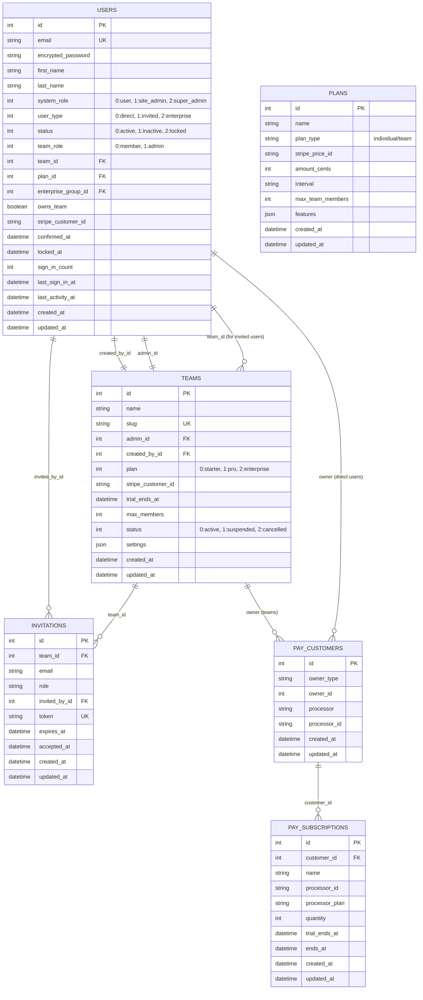
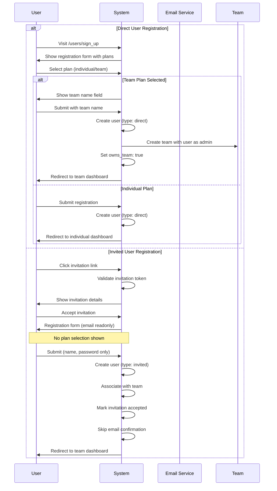

# SaaS Rails Application Architecture

## Overview

This is a comprehensive **Team-Based SaaS Rails 8.0.2 application** built with a unique dual-track user system that completely separates individual users from team-based users. The application implements a sophisticated multi-tenant architecture with enterprise-grade authentication, authorization, and billing systems.

### System Architecture Overview


## Core Architecture Principles

### 1. Triple-Track User System
The application maintains three distinct user ecosystems:

- **Direct Users**: Register directly, have personal billing, can create and own teams
- **Invited Users**: Invitation-only team members, no individual features
- **Enterprise Users**: Large organizations with custom plans (contact sales)

Key principles:
- Direct users CAN create and own teams while maintaining individual features
- Invited users are restricted to team features only
- No crossover between invited team members and individual features

```mermaid
graph LR
    subgraph "Direct User Track"
        DirectReg["Direct Registration"]
        DirectUser["Direct User<br/>(user_type: direct)"]
        PersonalBilling["Personal Billing<br/>(Stripe Customer)"]
        DirectFeatures["Individual Features"]
        TeamCreation["Can Create Teams<br/>(owns_team: true)"]
        
        DirectReg --> DirectUser
        DirectUser --> PersonalBilling
        DirectUser --> DirectFeatures
        DirectUser --> TeamCreation
    end
    
    subgraph "Invited User Track"
        TeamInvite["Team Invitation"]
        InvitedUser["Invited User<br/>(user_type: invited)"]
        TeamBilling["Team Billing<br/>(Shared)"]
        TeamFeatures["Team Features Only"]
        
        TeamInvite --> InvitedUser
        InvitedUser --> TeamBilling
        InvitedUser --> TeamFeatures
    end
    
    subgraph "Enterprise Track"
        ContactSales["Contact Sales"]
        EnterpriseUser["Enterprise User<br/>(user_type: enterprise)"]
        EnterpriseBilling["Enterprise Billing<br/>(Custom)"]
        EnterpriseFeatures["Enterprise Features"]
        
        ContactSales --> EnterpriseUser
        EnterpriseUser --> EnterpriseBilling
        EnterpriseUser --> EnterpriseFeatures
    end
    
    subgraph "Shared Components"
        Auth["Authentication<br/>(Devise)"]
        UserModel["User Model"]
        Security["Security<br/>(Pundit)"]
    end
    
    DirectUser --> Auth
    InvitedUser --> Auth
    Auth --> UserModel
    UserModel --> Security
    
    NoXover["❌ NO CROSSOVER<br/>Users cannot switch tracks"]
    
    style NoXover fill:#ffebee,stroke:#f44336,stroke-width:2px
    style DirectUser fill:#e8f5e8
    style InvitedUser fill:#e3f2fd
```



### 2. Multi-Tenant Architecture
- Teams operate as isolated tenants with unique URLs (`/teams/:team_slug`)
- Complete data isolation between teams
- Shared infrastructure with logical separation

### 3. Role-Based Access Control (RBAC)
Hierarchical permission system with five distinct user types:
1. **Super Admin**: Platform owner with complete system access
2. **Site Admin**: Customer support with limited admin access
3. **Direct User**: Individual users with personal accounts
4. **Team Admin**: Team managers with billing and member control
5. **Team Member**: Basic team users with limited permissions

```mermaid
graph TD
    subgraph "System Roles (system_role)"
        SuperAdmin["Super Admin<br/>🔑 Complete System Access<br/>• User Management<br/>• Team Management<br/>• System Configuration<br/>• Billing Overview"]
        SiteAdmin["Site Admin<br/>🛠️ Customer Support<br/>• User Support<br/>• Team Support<br/>• Limited Admin Access"]
        RegularUser["Regular User<br/>👤 Base User Level"]
    end
    
    subgraph "User Types (user_type)"
        DirectUser["Direct User<br/>🏠 Individual Account<br/>• Personal Billing<br/>• Independent Operation"]
        InvitedUser["Invited User<br/>👥 Team Member<br/>• Team Billing<br/>• Team Collaboration"]
    end
    
    subgraph "Team Roles (team_role)"
        TeamAdmin["Team Admin<br/>👑 Team Manager<br/>• Member Management<br/>• Billing Control<br/>• Team Settings"]
        TeamMember["Team Member<br/>👤 Basic Team User<br/>• Team Features<br/>• Limited Access"]
    end
    
    SuperAdmin -.-> |"Can impersonate"| SiteAdmin
    SuperAdmin -.-> |"Can impersonate"| RegularUser
    SiteAdmin -.-> |"Can support"| RegularUser
    
    RegularUser --> DirectUser
    RegularUser --> InvitedUser
    
    InvitedUser --> TeamAdmin
    InvitedUser --> TeamMember
    
    Hierarchy["Permission Hierarchy:<br/>Super Admin > Site Admin > Team Admin > Team Member > Direct User"]
    
    style SuperAdmin fill:#ff5722,color:#fff
    style SiteAdmin fill:#ff9800,color:#fff
    style TeamAdmin fill:#2196f3,color:#fff
    style DirectUser fill:#4caf50,color:#fff
    style TeamMember fill:#9c27b0,color:#fff
    style Hierarchy fill:#f5f5f5,stroke:#666,stroke-dasharray: 5 5
```



## Directory Structure

```
saas_ror_starter/
├── app/
│   ├── assets/
│   │   ├── builds/            # Compiled assets (tailwind.css)
│   │   ├── images/            # Image assets
│   │   ├── stylesheets/       # CSS files
│   │   ├── svg/icons/phosphor/ # Phosphor icon system
│   │   └── tailwind/          # Tailwind configuration
│   ├── controllers/
│   │   ├── admin/
│   │   │   ├── super/         # Super admin controllers
│   │   │   └── site/          # Site admin controllers
│   │   ├── teams/
│   │   │   ├── admin/         # Team admin controllers
│   │   │   └── [features]     # Team member controllers
│   │   ├── users/             # Individual user controllers
│   │   ├── concerns/          # Shared controller concerns
│   │   └── [public]           # Public-facing controllers
│   ├── javascript/
│   │   └── controllers/       # Stimulus controllers
│   ├── models/
│   │   ├── ahoy/              # Analytics models
│   │   ├── concerns/          # Model concerns
│   │   ├── user.rb            # Central user model
│   │   ├── team.rb            # Team management
│   │   ├── invitation.rb      # Invitation system
│   │   ├── plan.rb            # Subscription plans
│   │   ├── enterprise_group.rb # Enterprise organizations
│   │   ├── audit_log.rb       # Audit trail
│   │   └── email_change_request.rb # Email changes
│   ├── services/              # Business logic encapsulation
│   │   ├── teams/
│   │   ├── users/
│   │   └── audit_log_service.rb
│   ├── policies/              # Pundit authorization policies
│   ├── views/                 # ERB templates with Tailwind CSS
│   │   ├── admin/
│   │   ├── devise/
│   │   ├── layouts/
│   │   ├── teams/
│   │   └── users/
│   ├── mailers/              # Email functionality
│   ├── middleware/           # Rack middleware
│   └── validators/           # Custom validators
├── config/
│   ├── environments/         # Environment-specific config
│   ├── initializers/         # Application initializers
│   ├── locales/              # Internationalization
│   ├── database.yml          # Database configuration
│   ├── routes.rb             # URL routing
│   └── importmap.rb          # JavaScript imports
├── db/
│   ├── migrate/              # Database migrations (19 files)
│   ├── schema.rb             # Main database schema
│   ├── cable_schema.rb       # Solid Cable schema
│   ├── cache_schema.rb       # Solid Cache schema
│   ├── queue_schema.rb       # Solid Queue schema
│   └── seeds.rb              # Seed data
├── docs/                     # Comprehensive documentation
│   ├── architecture/
│   │   └── ARCHITECTURE.md   # This document
│   ├── security/             # Security documentation
│   ├── architecture_diagram.md # Visual diagrams
│   ├── bug_fixes.md          # Rails 8 compatibility fixes
│   ├── security.md           # Security implementation
│   ├── task_list.md          # Development roadmap
│   ├── testing.md            # Testing guide
│   ├── ui_components.md      # UI/Design system
│   └── pitfalls.md           # Common issues & solutions
├── test/                     # Minitest test suite
│   ├── controllers/          # Controller tests
│   ├── fixtures/             # Test data
│   ├── integration/          # Integration tests
│   ├── models/               # Model tests
│   ├── services/             # Service tests
│   └── system/               # System/browser tests
├── lib/
│   └── tasks/                # Custom rake tasks
├── public/                   # Static public files
├── vendor/                   # Third-party code
└── CLAUDE.md                 # Project specifications
```

## Key Components

### Models Layer

#### User Model (`app/models/user.rb`)
The central authentication model with complex role management:

```ruby
class User < ApplicationRecord
  # Devise modules for authentication
  devise :database_authenticatable, :registerable, :recoverable, 
         :rememberable, :validatable, :confirmable, :trackable, :lockable

  # Pay gem for Stripe billing (individual users only)
  include Pay::Billable

  # Enums for role management
  enum system_role: { user: 0, site_admin: 1, super_admin: 2 }
  enum user_type: { direct: 0, invited: 1 }
  enum status: { active: 0, inactive: 1, locked: 2 }
  enum team_role: { member: 0, admin: 1 }

  # Associations
  belongs_to :team, optional: true
  has_many :sent_invitations, class_name: 'Invitation', foreign_key: 'invited_by_id'

  # Business rule validations
  validates :team_id, absence: true, if: :direct?
  validates :team_id, presence: true, if: :invited?
end
```

#### Team Model (`app/models/team.rb`)
Multi-tenant team management with billing:

```ruby
class Team < ApplicationRecord
  include Pay::Billable  # Team-level Stripe billing

  # Associations
  belongs_to :admin, class_name: 'User'
  has_many :users, dependent: :restrict_with_error
  has_many :invitations, dependent: :destroy

  # Plans and status
  enum plan: { starter: 0, pro: 1, enterprise: 2 }
  enum status: { active: 0, suspended: 1, cancelled: 2 }

  # URL-friendly slugs
  validates :slug, uniqueness: true, format: { with: /\A[a-z0-9\-]+\z/ }
end
```

#### Invitation Model (`app/models/invitation.rb`)
Secure token-based invitation system:

```ruby
class Invitation < ApplicationRecord
  belongs_to :team
  belongs_to :invited_by, class_name: 'User'

  # Security validations
  validates :email, uniqueness: { scope: :team_id }
  validate :email_not_in_users_table

  # Token generation
  before_validation :generate_secure_token, if: :new_record?
end
```

### Controllers Layer

The controller hierarchy enforces access control through inheritance:

```mermaid
graph TD
    App["ApplicationController<br/>🏠 Base Controller<br/>• CSRF Protection<br/>• Exception Handling<br/>• Common Helpers"]
    
    Auth["AuthenticatedController<br/>🔐 Requires Login<br/>• User Authentication<br/>• Session Management<br/>• Activity Tracking"]
    
    Public["PublicController<br/>🌐 No Auth Required<br/>• Landing Pages<br/>• Public API<br/>• Static Content"]
    
    AdminBase["AdminBaseController<br/>👨‍💼 Admin Access<br/>• Admin Authentication<br/>• Admin Navigation<br/>• Audit Logging"]
    
    TeamBase["TeamBaseController<br/>👥 Team Context<br/>• Team Scoping<br/>• Team Authorization<br/>• Team Navigation"]
    
    UserBase["UserBaseController<br/>👤 User Context<br/>• User Scoping<br/>• User Authorization<br/>• User Navigation"]
    
    SuperBase["Admin::SuperBaseController<br/>🔑 Super Admin Only<br/>• System Management<br/>• User Management<br/>• Team Management"]
    
    SiteBase["Admin::SiteBaseController<br/>🛠️ Site Admin<br/>• Customer Support<br/>• Limited Admin Access<br/>• User Assistance"]
    
    TeamsAdmin["Teams::AdminBaseController<br/>👑 Team Admin<br/>• Team Settings<br/>• Member Management<br/>• Billing Control"]
    
    App --> Auth
    App --> Public
    Auth --> AdminBase
    Auth --> TeamBase
    Auth --> UserBase
    AdminBase --> SuperBase
    AdminBase --> SiteBase
    TeamBase --> TeamsAdmin
    
    subgraph "Specific Controllers"
        SuperControllers["• UsersController<br/>• TeamsController<br/>• SystemController"]
        SiteControllers["• SupportController<br/>• HelpController"]
        TeamControllers["• DashboardController<br/>• ProjectsController<br/>• MembersController"]
        TeamAdminControllers["• SettingsController<br/>• BillingController<br/>• InvitationsController"]
        UserControllers["• ProfileController<br/>• BillingController<br/>• PreferencesController"]
    end
    
    SuperBase -.-> SuperControllers
    SiteBase -.-> SiteControllers
    TeamBase -.-> TeamControllers
    TeamsAdmin -.-> TeamAdminControllers
    UserBase -.-> UserControllers
    
    style App fill:#f5f5f5
    style Auth fill:#e3f2fd
    style Public fill:#e8f5e8
    style AdminBase fill:#fff3e0
    style SuperBase fill:#ffebee
    style SiteBase fill:#fff8e1
    style TeamBase fill:#f3e5f5
    style TeamsAdmin fill:#e8eaf6
    style UserBase fill:#e0f2f1
```



### Service Objects

Business logic is encapsulated in service objects following the Single Responsibility Principle:

#### Teams::CreationService
Handles the complex team creation process:
- Validates super admin permissions
- Creates team with proper slug
- Assigns team admin
- Sets up Stripe billing
- Sends notifications

#### Users::StatusManagementService
Manages user status changes with:
- Authorization checks
- Audit logging
- Email notifications
- Forced logout for deactivated users

### Authorization (Pundit Policies)

Fine-grained authorization using Pundit policies:

```ruby
class TeamPolicy < ApplicationPolicy
  def show?
    super_admin? || site_admin? || team_member?
  end

  def update?
    super_admin? || team_admin?
  end

  def destroy?
    super_admin?
  end

  private

  def team_member?
    user.team_id == record.id
  end

  def team_admin?
    user.team_id == record.id && user.team_role == 'admin'
  end
end
```

## Database Schema

### Entity Relationship Diagram



### Core Tables

#### users
- **Identity**: email, encrypted_password, first_name, last_name
- **Roles**: system_role, user_type, team_role
- **Status**: status, confirmed_at, locked_at
- **Associations**: team_id (for invited users only)
- **Billing**: stripe_customer_id (for direct users only)
- **Tracking**: sign_in_count, last_sign_in_at, last_activity_at

#### teams
- **Identity**: name, slug (unique URL identifier)
- **Management**: admin_id, created_by_id
- **Billing**: plan, stripe_customer_id, trial_ends_at
- **Limits**: max_members, status
- **Settings**: JSON configuration storage

#### invitations
- **Invitation**: team_id, email, role, invited_by_id
- **Security**: token (unique), expires_at
- **Status**: accepted_at

#### plans
- **Definition**: name, plan_type (individual/team)
- **Billing**: stripe_price_id, amount_cents, interval
- **Limits**: max_team_members, features (JSON)

### Database Constraints

The database enforces business rules through constraints:

```sql
-- Users table constraint
CONSTRAINT user_type_team_check CHECK (
  (user_type = 'direct' AND team_id IS NULL AND team_role IS NULL) OR
  (user_type = 'invited' AND team_id IS NOT NULL AND team_role IS NOT NULL)
)

-- Invitations table constraint
CONSTRAINT no_existing_user CHECK (
  NOT EXISTS (SELECT 1 FROM users WHERE users.email = invitations.email)
)
```

## Frontend Architecture

### Technology Stack
- **Import Maps**: Modern JavaScript without bundling complexity
- **Turbo**: SPA-like navigation without a frontend framework
- **Stimulus**: Modest JavaScript framework for HTML enhancement
- **Tailwind CSS**: Utility-first CSS framework
- **Rails Icons**: Consistent iconography throughout

### UI Organization
- **Layouts**: Separate layouts for admin, team, and user interfaces
- **Components**: Reusable Tailwind components for consistency
- **Forms**: Turbo-enhanced forms with inline validation
- **Navigation**: Context-aware navigation based on user type

## Security Architecture

### Authentication & Authorization Flow


### Authentication
- **Devise**: Industry-standard Rails authentication
- **Confirmation**: Email verification for all new accounts
- **Lockable**: Account locking after failed attempts
- **Trackable**: Login tracking and analytics

### Authorization
- **Pundit**: Policy-based authorization
- **Role checks**: Every action verified against user permissions
- **Team scoping**: Automatic data filtering by team context
- **Admin impersonation**: Secure user impersonation for support

### Security Measures
- **CSRF protection**: Rails default protection enabled
- **Strong parameters**: Whitelist all controller inputs
- **SQL injection prevention**: Parameterized queries throughout
- **XSS protection**: Automatic HTML escaping
- **Session security**: Secure session storage and rotation

## Registration & Invitation Flow



## Team Management Flow

```mermaid
flowchart TD
    SuperAdmin[Super Admin] --> CreateTeam[Create Team]
    CreateTeam --> TeamCreation{Teams::CreationService}
    
    TeamCreation --> ValidatePerms[Validate Super Admin<br/>Permissions]
    ValidatePerms --> ValidateData[Validate Team Data<br/>Name, Slug, Admin]
    ValidateData --> CreateTeamRecord[Create Team Record]
    CreateTeamRecord --> SetupBilling[Setup Stripe Billing<br/>Team Customer]
    SetupBilling --> AssignAdmin[Assign Team Admin<br/>Update User Record]
    AssignAdmin --> SendNotification[Send Welcome Email<br/>Team Created]
    
    TeamAdmin[Team Admin] --> InviteUser[Invite Team Member]
    InviteUser --> InvitationService{Invitation Service}
    
    InvitationService --> ValidateTeamPerms[Validate Team Admin<br/>Permissions]
    ValidateTeamPerms --> CheckTeamLimits[Check Team Member<br/>Limits]
    CheckTeamLimits --> CreateInvitation[Create Invitation<br/>Secure Token]
    CreateInvitation --> SendInviteEmail[Send Invitation Email<br/>Secure Link]
    
    InvitedUser[Invited User] --> AcceptInvite[Accept Invitation]
    AcceptInvite --> ValidateToken[Validate Token<br/>Check Expiry]
    ValidateToken --> CreateUser[Create User Account<br/>user_type: invited]
    CreateUser --> AssignToTeam[Assign to Team<br/>Set team_id, team_role]
    AssignToTeam --> CompleteOnboarding[Complete Onboarding<br/>Team Access]
    
    TeamAdmin --> ManageMembers[Manage Team Members]
    ManageMembers --> MemberActions{Member Actions}
    
    MemberActions --> ChangeRole[Change Member Role<br/>Admin ↔ Member]
    MemberActions --> RemoveMember[Remove Team Member<br/>Deactivate User]
    MemberActions --> ManageBilling[Manage Team Billing<br/>Stripe Integration]
    
    ChangeRole --> UpdateUserRecord[Update User Record<br/>team_role]
    RemoveMember --> DeactivateUser[Deactivate User<br/>status: inactive]
    ManageBilling --> StripeOperations[Stripe Operations<br/>Plans, Payments]
    
    subgraph "Business Rules"
        Rules["• Team Admin must be invited user<br/>• Direct users cannot join teams<br/>• Team members share team billing<br/>• Invitation tokens expire<br/>• Team member limits enforced"]
    end
    
    subgraph "Security Checks"
        Security["• Token validation<br/>• Permission verification<br/>• Team scoping<br/>• Audit logging<br/>• Email verification"]
    end
    
    style CreateTeam fill:#e3f2fd
    style InviteUser fill:#f3e5f5
    style AcceptInvite fill:#e8f5e8
    style ManageMembers fill:#fff3e0
    style Rules fill:#fce4ec
    style Security fill:#ffebee
```



## Billing & Payments

### Stripe Integration
- **Pay gem**: Simplified Stripe integration for Rails
- **Dual billing**: Separate flows for individuals and teams
- **Webhooks**: Automated subscription lifecycle management
- **Trial periods**: Configurable trials for new teams

### Subscription Management
- **Plan changes**: Upgrade/downgrade with proration
- **Payment methods**: Credit card management UI
- **Invoice history**: Downloadable invoices
- **Failed payments**: Automatic retry and notifications

## Background Jobs

### Solid Queue Integration
- **Email delivery**: Asynchronous email sending
- **Billing webhooks**: Stripe event processing
- **Analytics**: Background data aggregation
- **Cleanup tasks**: Expired invitation removal

## Analytics & Monitoring

### Ahoy Analytics
- **User tracking**: Page views and events
- **Team analytics**: Aggregated team usage metrics
- **Custom events**: Business-specific event tracking
- **Privacy-aware**: GDPR-compliant tracking

### Blazer Reporting
- **Admin dashboards**: SQL-based reporting
- **Scheduled reports**: Automated email reports
- **Custom queries**: Ad-hoc business intelligence

## Development Workflow

### Environment Setup
1. Ruby 3.2+ with Rails 8.0.2
2. SQLite for development (PostgreSQL ready)
3. Redis for caching and background jobs
4. Stripe CLI for webhook testing

### Testing Strategy
- **RSpec**: Comprehensive test suite
- **Factory Bot**: Test data generation
- **System tests**: Full integration testing
- **CI/CD ready**: GitHub Actions configuration

### Code Quality
- **Rubocop**: Ruby style enforcement
- **Brakeman**: Security vulnerability scanning
- **SimpleCov**: Code coverage tracking
- **Bullet**: N+1 query detection

## Deployment Architecture

### Production Stack
- **Kamal**: Modern deployment solution
- **Thruster**: HTTP/2 asset serving
- **Solid Cache**: Database-backed caching
- **Solid Cable**: Database-backed WebSockets

### Scaling Considerations
- **Database indexing**: Optimized query performance
- **Fragment caching**: View-level caching
- **CDN integration**: Asset delivery optimization
- **Background job queues**: Workload distribution

## Key Design Decisions

### 1. Dual-Track User System
**Decision**: Complete separation between individual and team users
**Rationale**: Simplifies billing, permissions, and user experience
**Trade-off**: Users cannot switch between modes

### 2. Database Constraints
**Decision**: Enforce business rules at the database level
**Rationale**: Data integrity regardless of application bugs
**Trade-off**: More complex migrations

### 3. Service Objects
**Decision**: Encapsulate complex operations in service classes
**Rationale**: Testability and single responsibility
**Trade-off**: Additional abstraction layer

### 4. Slug-Based Team URLs
**Decision**: Use slugs instead of IDs in URLs
**Rationale**: Better SEO and user experience
**Trade-off**: Additional slug management complexity

## Future Considerations

### Planned Enhancements
- API development for mobile apps
- OAuth2 provider for third-party integrations
- Advanced team permissions system
- White-label customization options

### Technical Debt
- Migrate from SQLite to PostgreSQL for production
- Implement comprehensive API versioning
- Add end-to-end encryption for sensitive data
- Enhance real-time features with ActionCable

## Recent Architectural Updates

### Invitation Status Management
The invitation system now properly tracks acceptance status:
- **Accepted invitations** show "User joined" with the join date
- **Expired invitations** allow deletion but not resending
- **Pending invitations** can be resent or revoked
- **Controller validation** prevents revoking accepted invitations

### Post-Registration Redirect Logic
Smart routing based on user type and ownership:
```ruby
def after_sign_up_path_for(resource)
  if resource.direct? && resource.owns_team? && resource.team
    # Direct users who own a team go to their team dashboard
    team_root_path(team_slug: resource.team.slug)
  elsif resource.direct?
    # Direct users without teams go to individual dashboard
    user_dashboard_path
  elsif resource.invited? && resource.team
    # Invited users go to their team dashboard
    team_root_path(team_slug: resource.team.slug)
  else
    root_path
  end
end
```

### Plan Selection During Registration
Dynamic plan selection for direct users:
- **Individual plans**: No additional fields required
- **Team plans**: Shows team name field via Stimulus controller
- **Enterprise plans**: Contact sales message (not selectable)
- **Invited users**: No plan selection (inherit team billing)

### Virtual Attributes Pattern
Clean separation of concerns using virtual attributes:
```ruby
# User model
attr_accessor :team_name          # For team creation during registration
attr_accessor :accepting_invitation # Skip validation when accepting invitations
```

### Validation Skipping for Invitations
Invited users bypass certain validations:
- Email confirmation skipped (already verified via invitation)
- Invitation conflict check skipped during acceptance
- Immediate activation without confirmation emails

## Conclusion

This Rails 8 SaaS application represents a production-ready, scalable architecture suitable for modern multi-tenant SaaS businesses. The careful separation of concerns, comprehensive security measures, and thoughtful design decisions create a maintainable codebase that can grow with business needs.

The architecture prioritizes:
- **Security**: Multiple layers of authentication and authorization
- **Scalability**: Service-oriented design and proper caching
- **Maintainability**: Clear separation of concerns and comprehensive testing
- **User Experience**: Modern frontend with Turbo/Stimulus
- **Business Flexibility**: Extensible design for future features