# System Overview Diagrams

## High-Level System Architecture

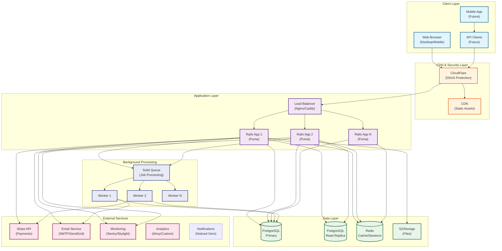

## Request Flow Architecture

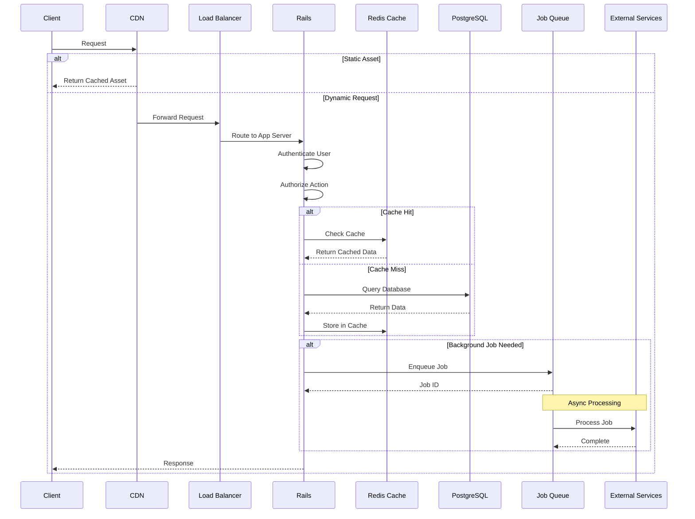

## Triple-Track User System Architecture

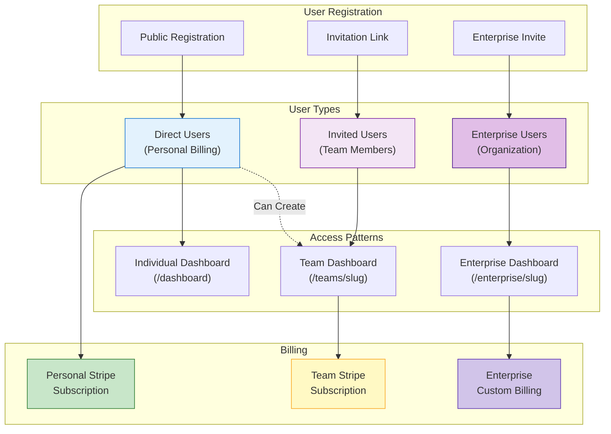

## Component Communication

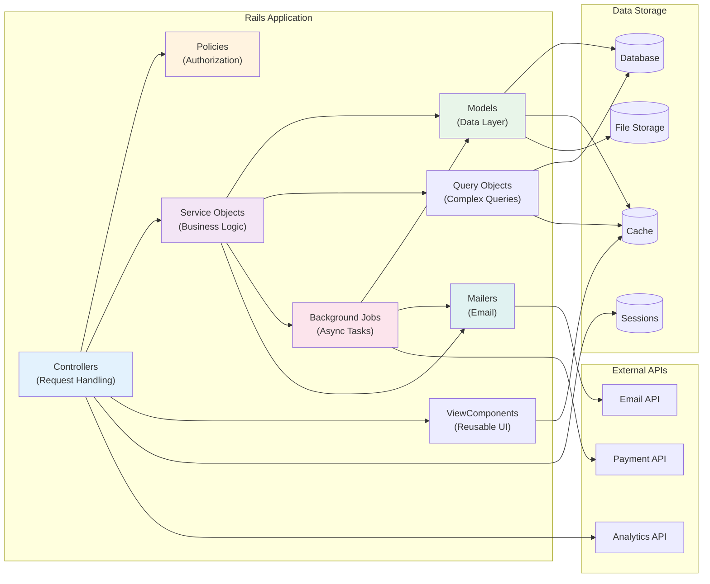

## Deployment Architecture

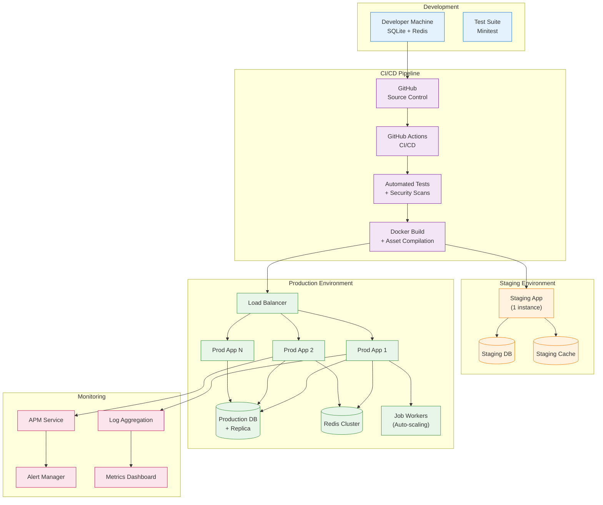

## Security Architecture

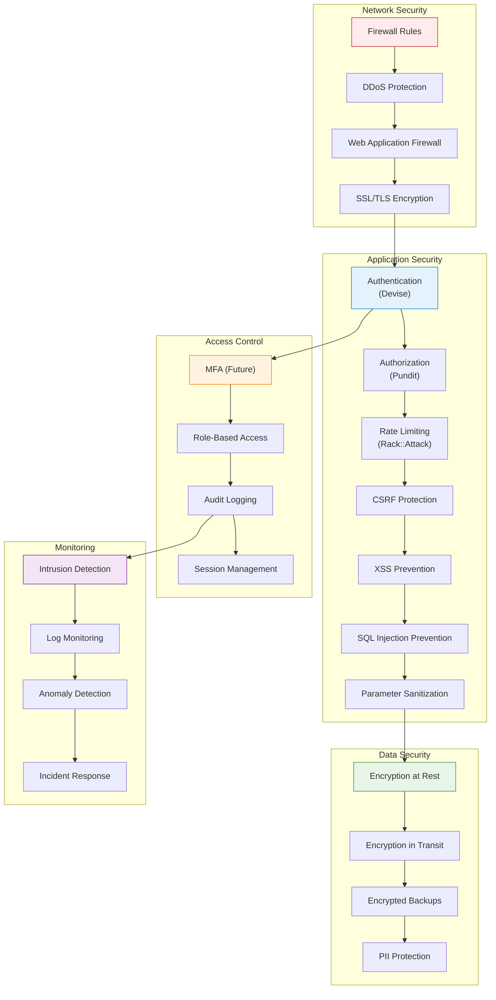

## Data Flow Architecture

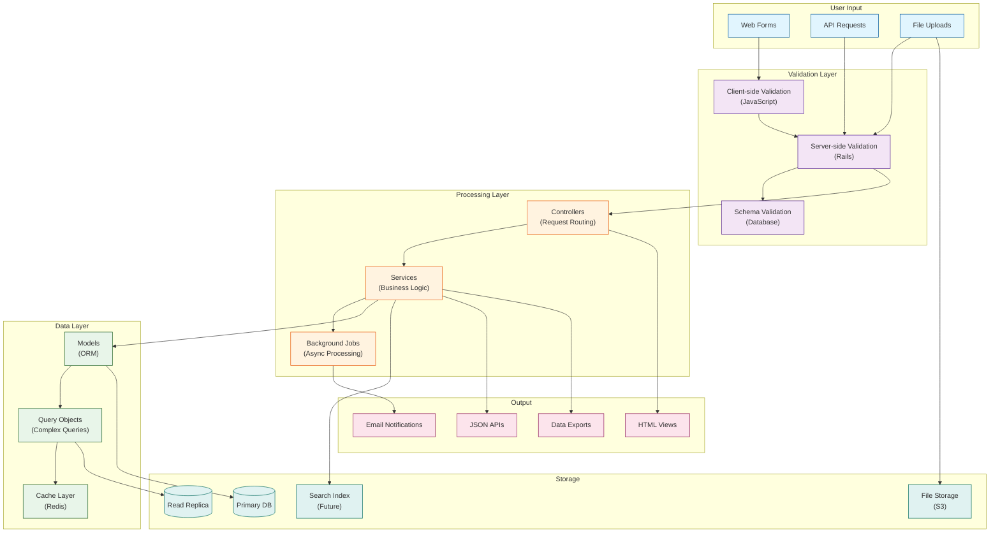

## Performance & Caching Architecture

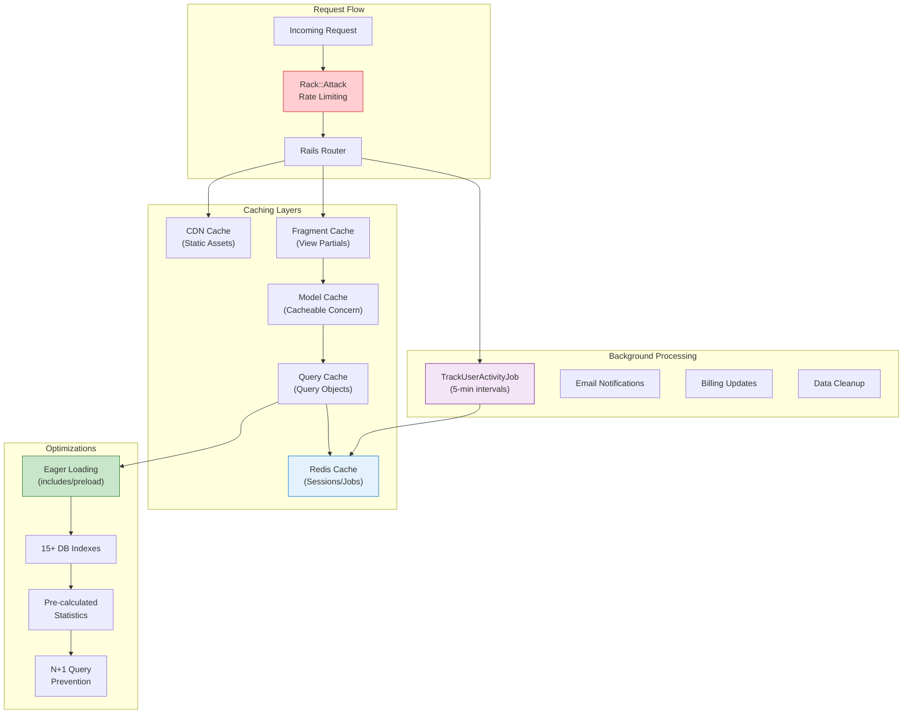

## Enterprise Architecture

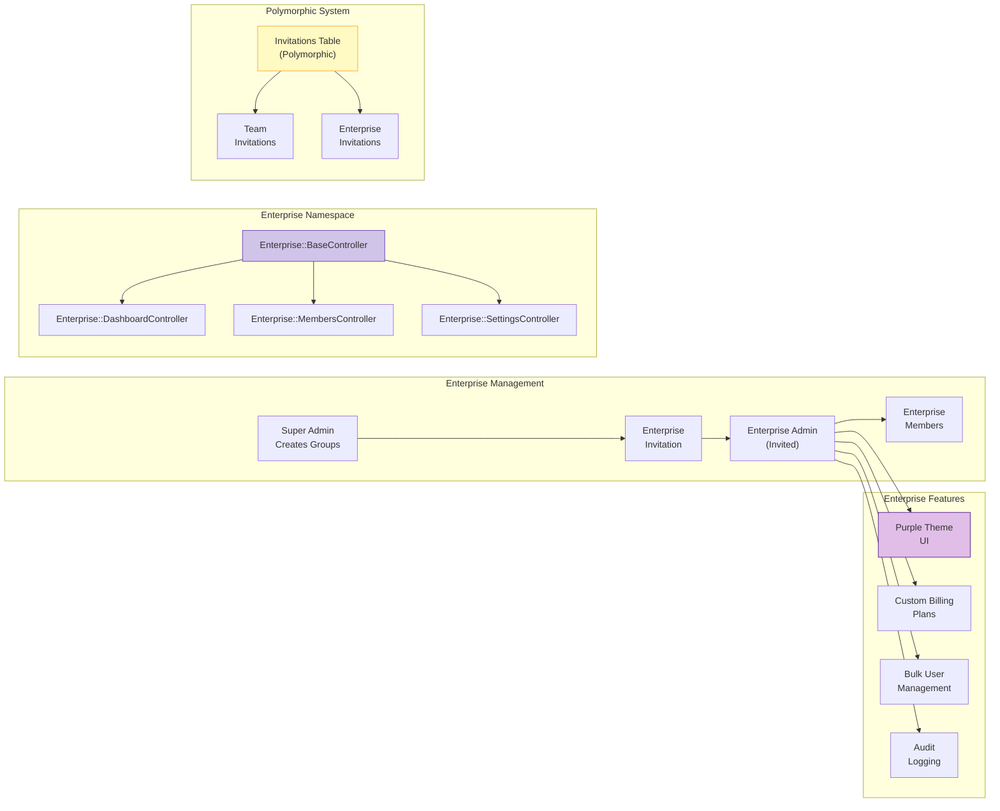

## Scaling Architecture

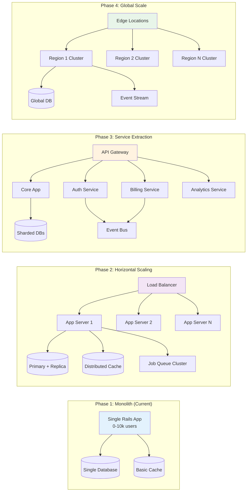

## Current Application State (January 2025)

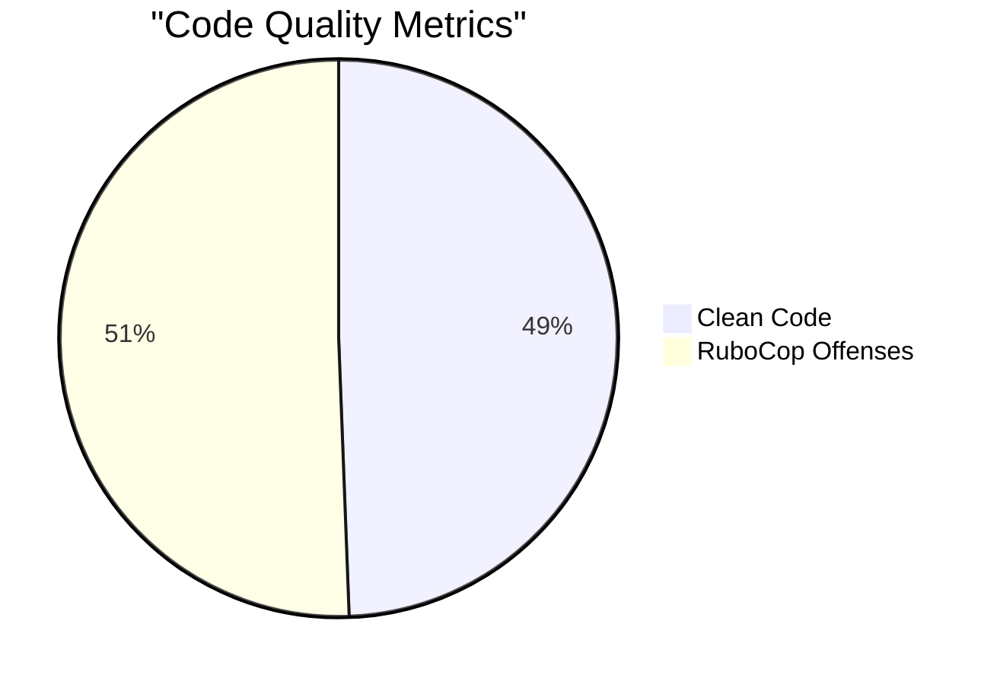

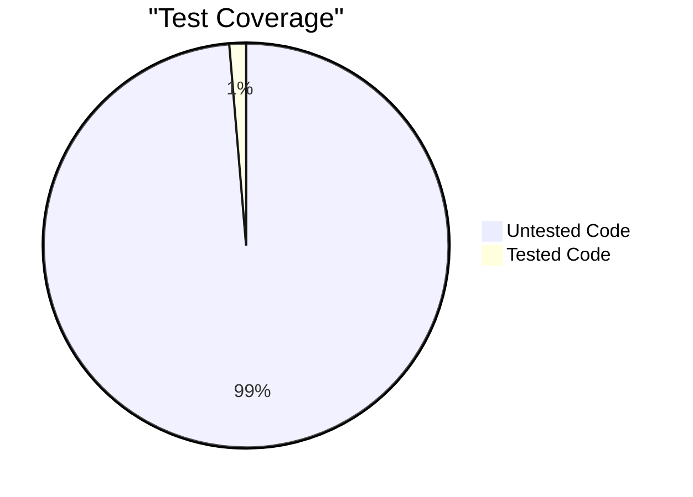

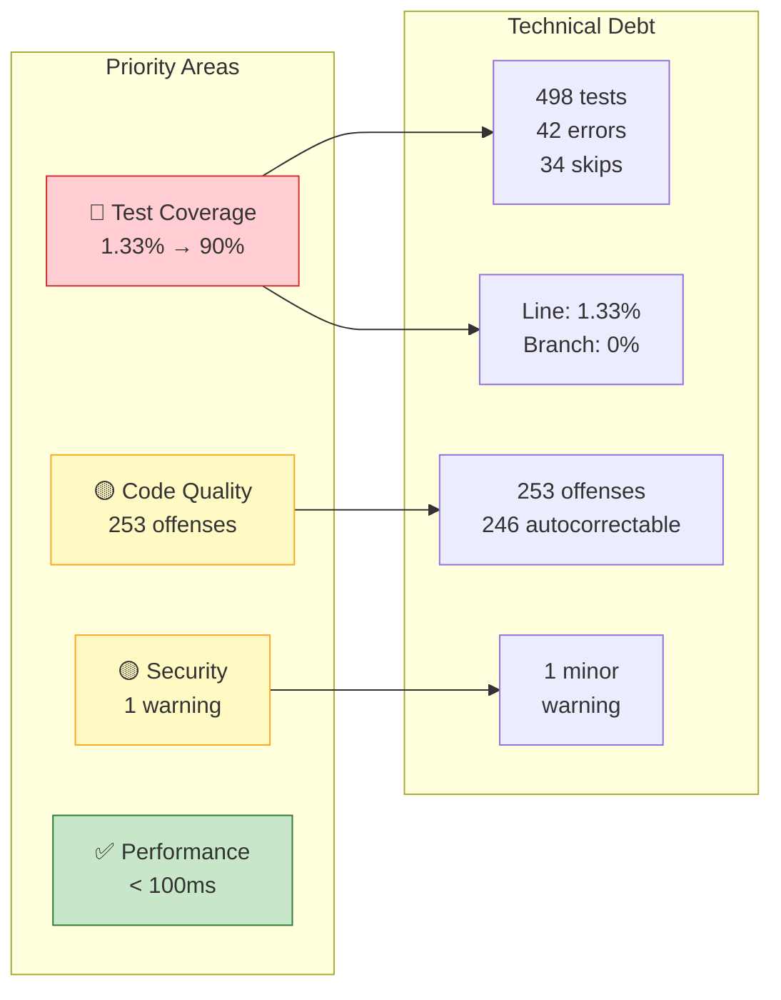

---

**Last Updated**: January 2025
**Related**: [User Flow Diagrams](user-flows.md) | [Database ERD](database-erd.md) | [Architecture Overview](../README.md)