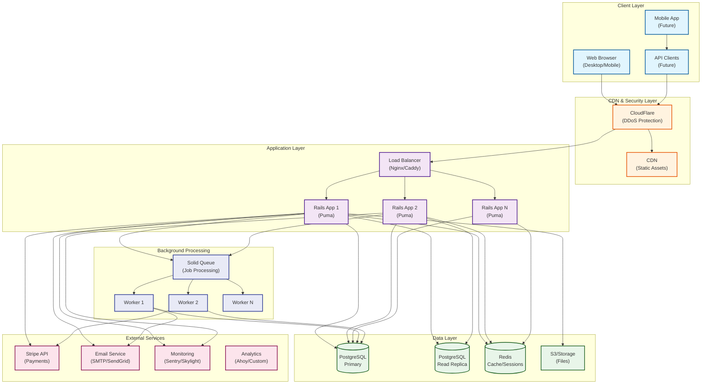
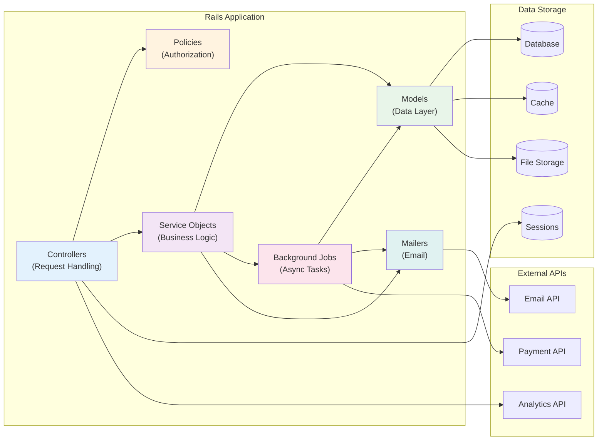
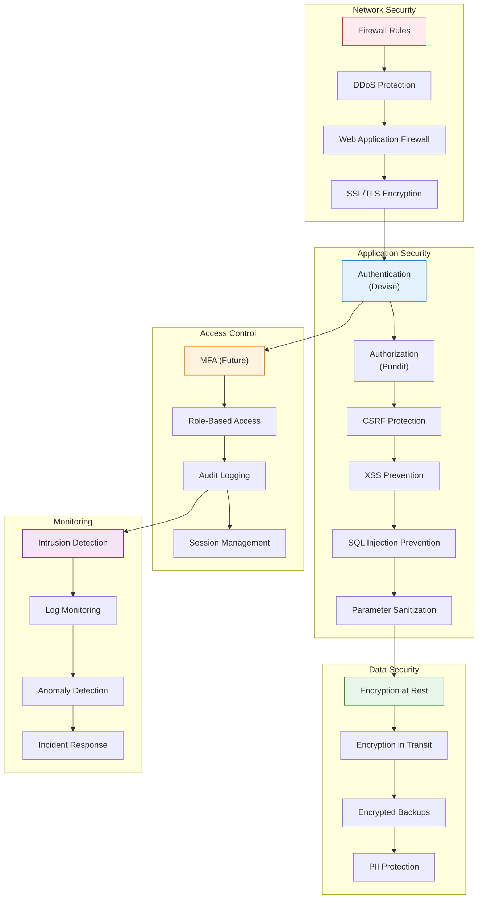

# System Overview Diagrams

## High-Level System Architecture

## Request Flow Architecture

```mermaid
sequenceDiagram
    participant Client
    participant CDN
    participant LB as Load Balancer
    participant Rails
    participant Cache as Redis Cache
    participant DB as PostgreSQL
    participant Queue as Job Queue
    participant External as External Services
    
    Client->>CDN: Request
    
    alt Static Asset
        CDN-->>Client: Return Cached Asset
    else Dynamic Request
        CDN->>LB: Forward Request
        LB->>Rails: Route to App Server
        
        Rails->>Rails: Authenticate User
        Rails->>Rails: Authorize Action
        
        alt Cache Hit
            Rails->>Cache: Check Cache
            Cache-->>Rails: Return Cached Data
        else Cache Miss
            Rails->>DB: Query Database
            DB-->>Rails: Return Data
            Rails->>Cache: Store in Cache
        end
        
        alt Background Job Needed
            Rails->>Queue: Enqueue Job
            Queue-->>Rails: Job ID
            
            Note over Queue,External: Async Processing
            Queue->>External: Process Job
            External-->>Queue: Complete
        end
        
        Rails-->>Client: Response
    end
```

## Component Communication

## Deployment Architecture

## Security Architecture

## Data Flow Architecture

## Scaling Architecture

---

**Last Updated**: June 2025
**Related**: [User Flow Diagrams](user-flows.md) | [Database ERD](database-erd.md)