# User Flow Diagrams

## User Registration Flows

### Direct User Registration Flow (Updated with Onboarding)

```mermaid
flowchart TD
    Start([User visits site]) --> Home[Homepage]
    Home --> SignUp[Click Sign Up]
    SignUp --> RegForm[Registration Form]
    
    RegForm --> EnterInfo[Enter Email, Name, Password<br/>No Plan Selection]
    EnterInfo --> CreateUser[Create Direct User<br/>plan_id: null<br/>onboarding_completed: false]
    CreateUser --> SendConfirm[Send Confirmation Email]
    SendConfirm --> ShowMessage[Show Confirmation Message]
    
    ShowMessage --> UserConfirms[User Confirms Email]
    UserConfirms --> Login[User Logs In]
    Login --> CheckOnboarding{Onboarding Complete?}
    
    CheckOnboarding -->|No| OnboardingFlow[Redirect to Onboarding]
    CheckOnboarding -->|Yes| Dashboard[Redirect to Dashboard]
    
    OnboardingFlow --> Welcome[Welcome Screen<br/>'Welcome, [Name]!']
    Welcome --> PlanSelection[Plan Selection Page]
    PlanSelection --> SelectPlan{Select Plan Type}
    
    SelectPlan -->|Individual Plan| IndividualFlow[Select Individual Plan]
    SelectPlan -->|Team Plan| TeamFlow[Show Team Name Field]
    
    IndividualFlow --> AssignPlan[Assign Plan to User]
    AssignPlan --> CompleteOnboarding[Mark Onboarding Complete]
    
    TeamFlow --> EnterTeamName[Enter Team Name]
    EnterTeamName --> CreateTeam[Create Team Record]
    CreateTeam --> SetOwnership[Set owns_team = true]
    SetOwnership --> AssignTeamPlan[Assign Team Plan]
    AssignTeamPlan --> CompleteOnboarding
    
    CompleteOnboarding --> Dashboard
    
    style Start fill:#e8f5e9
    style Dashboard fill:#c8e6c9
    style OnboardingFlow fill:#fff9c4
    style Welcome fill:#fff9c4
    style PlanSelection fill:#fff9c4
```

### Onboarding Flow Implementation Details

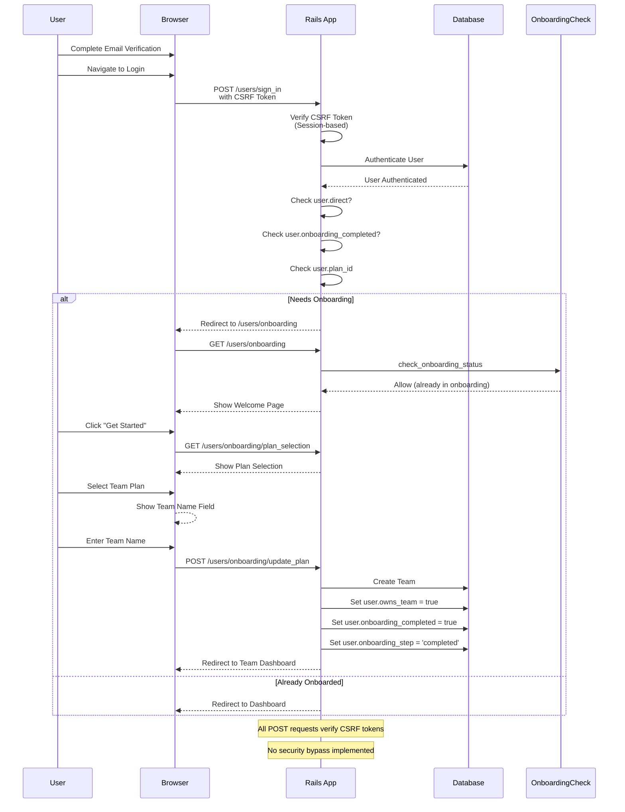
```mermaid
sequenceDiagram
    participant User
    participant Browser
    participant Rails as Rails App
    participant DB as Database
    participant Concern as OnboardingCheck
    
    User->>Browser: Complete Email Verification
    User->>Browser: Navigate to Login
    Browser->>Rails: POST /users/sign_in<br/>with CSRF Token
    
    Rails->>Rails: Verify CSRF Token<br/>(Session-based)
    Rails->>DB: Authenticate User
    DB-->>Rails: User Authenticated
    
    Rails->>Rails: Check user.direct?
    Rails->>Rails: Check user.onboarding_completed?
    Rails->>Rails: Check user.plan_id
    
    alt Needs Onboarding
        Rails-->>Browser: Redirect to /users/onboarding
        Browser->>Rails: GET /users/onboarding
        Rails->>Concern: check_onboarding_status
        Concern-->>Rails: Allow (already in onboarding)
        Rails-->>Browser: Show Welcome Page
        
        User->>Browser: Click "Get Started"
        Browser->>Rails: GET /users/onboarding/plan_selection
        Rails-->>Browser: Show Plan Selection
        
        User->>Browser: Select Team Plan
        Browser-->>Browser: Show Team Name Field
        User->>Browser: Enter Team Name
        Browser->>Rails: POST /users/onboarding/update_plan
        
        Rails->>DB: Create Team
        Rails->>DB: Set user.owns_team = true
        Rails->>DB: Set user.onboarding_completed = true
        Rails->>DB: Set user.onboarding_step = 'completed'
        
        Rails-->>Browser: Redirect to Team Dashboard
    else Already Onboarded
        Rails-->>Browser: Redirect to Dashboard
    end
    
    Note over Rails: All POST requests verify CSRF tokens
    Note over Rails: No security bypass implemented
```

### Team Invitation Flow

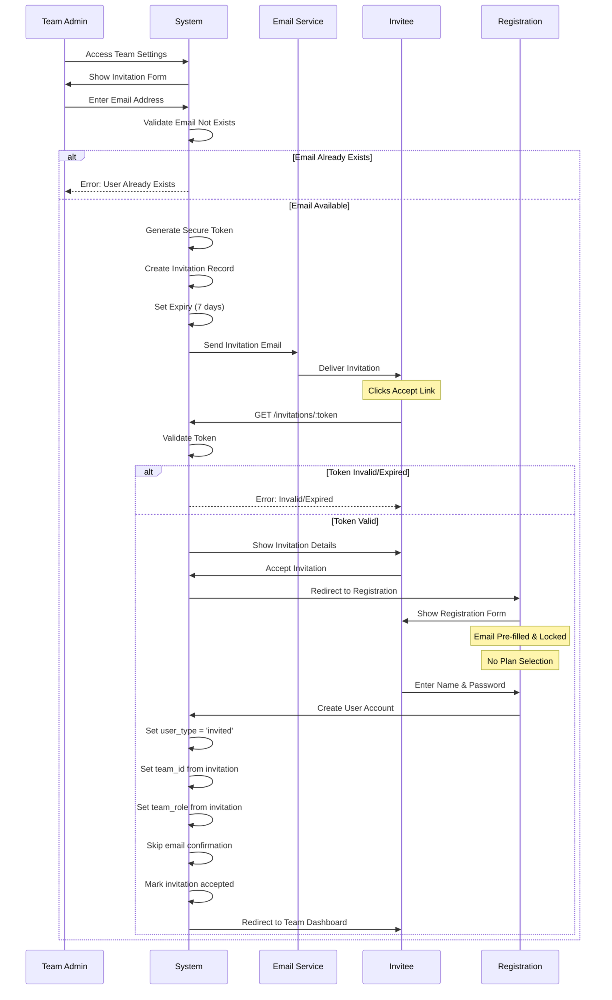
```mermaid
sequenceDiagram
    participant TA as Team Admin
    participant System
    participant Email as Email Service
    participant Invitee
    participant Reg as Registration
    
    TA->>System: Access Team Settings
    System->>TA: Show Invitation Form
    TA->>System: Enter Email Address
    
    System->>System: Validate Email Not Exists
    alt Email Already Exists
        System-->>TA: Error: User Already Exists
    else Email Available
        System->>System: Generate Secure Token
        System->>System: Create Invitation Record
        System->>System: Set Expiry (7 days)
        System->>Email: Send Invitation Email
        Email->>Invitee: Deliver Invitation
        
        Note over Invitee: Clicks Accept Link
        
        Invitee->>System: GET /invitations/:token
        System->>System: Validate Token
        
        alt Token Invalid/Expired
            System-->>Invitee: Error: Invalid/Expired
        else Token Valid
            System->>Invitee: Show Invitation Details
            Invitee->>System: Accept Invitation
            System->>Reg: Redirect to Registration
            
            Reg->>Invitee: Show Registration Form
            Note over Reg: Email Pre-filled & Locked
            Note over Reg: No Plan Selection
            
            Invitee->>Reg: Enter Name & Password
            Reg->>System: Create User Account
            
            System->>System: Set user_type = 'invited'
            System->>System: Set team_id from invitation
            System->>System: Set team_role from invitation
            System->>System: Skip email confirmation
            System->>System: Mark invitation accepted
            
            System->>Invitee: Redirect to Team Dashboard
        end
    end
```

### Enterprise User Flow (Polymorphic Invitations)

```mermaid
flowchart TD
    SA[Super Admin] --> CreateEnt[Create Enterprise Group]
    CreateEnt --> EnterDetails[Enter Organization Details]
    EnterDetails --> SelectPlan[Select Enterprise Plan]
    SelectPlan --> SetContact[Set Contact Info]
    SetContact --> CreateGroup[Create Enterprise Group Record<br/>admin_id: null]
    
    CreateGroup --> SendAdminInv[Send Admin Invitation<br/>Polymorphic]
    SendAdminInv --> CreateInv[Create Invitation<br/>invitable_type: EnterpriseGroup<br/>invitable_id: group.id]
    
    CreateInv --> AdminEmail[Admin Receives Email]
    AdminEmail --> AdminAccept[Admin Accepts Invitation]
    AdminAccept --> AdminReg[Admin Registration]
    AdminReg --> CreateAdmin[Create Enterprise Admin User<br/>user_type: enterprise]
    CreateAdmin --> UpdateGroup[Update Enterprise Group<br/>admin_id = user.id]
    UpdateGroup --> AdminDash[Access Enterprise Dashboard<br/>Purple Theme]
    
    AdminDash --> InviteMembers[Invite Members]
    InviteMembers --> MemberInv[Create Member Invitations<br/>Polymorphic]
    MemberInv --> MemberFlow[Member Invitation Flow]
    MemberFlow --> MemberReg[Member Registration]
    MemberReg --> CreateMember[Create Enterprise Member]
    CreateMember --> MemberAccess[Access Enterprise Portal]
    
    style SA fill:#ffebee
    style AdminDash fill:#e1bee7,stroke:#4a148c
    style MemberAccess fill:#e1bee7,stroke:#4a148c
    style CreateInv fill:#fff9c4,stroke:#f9a825
```

## Authentication & Authorization Flows

### Login Flow with Security Checks (Updated with Onboarding)

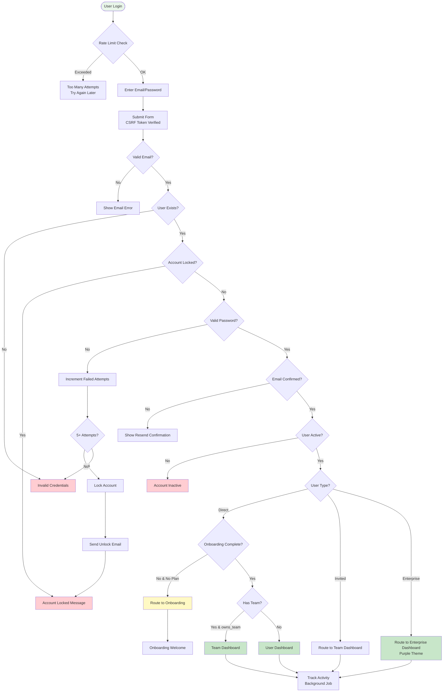
```mermaid
flowchart TD
    Start([User Login]) --> RateLimit{Rate Limit Check}
    RateLimit -->|Exceeded| RateLimitError[Too Many Attempts<br/>Try Again Later]
    RateLimit -->|OK| EnterCreds[Enter Email/Password]
    EnterCreds --> Submit[Submit Form<br/>CSRF Token Verified]
    
    Submit --> ValidateEmail{Valid Email?}
    ValidateEmail -->|No| EmailError[Show Email Error]
    ValidateEmail -->|Yes| CheckUser{User Exists?}
    
    CheckUser -->|No| GenericError[Invalid Credentials]
    CheckUser -->|Yes| CheckLocked{Account Locked?}
    
    CheckLocked -->|Yes| ShowLocked[Account Locked Message]
    CheckLocked -->|No| ValidatePass{Valid Password?}
    
    ValidatePass -->|No| IncAttempts[Increment Failed Attempts]
    ValidatePass -->|Yes| CheckConfirmed{Email Confirmed?}
    
    IncAttempts --> CheckMax{5+ Attempts?}
    CheckMax -->|Yes| LockAccount[Lock Account]
    CheckMax -->|No| GenericError
    
    LockAccount --> SendUnlock[Send Unlock Email]
    SendUnlock --> ShowLocked
    
    CheckConfirmed -->|No| ResendOption[Show Resend Confirmation]
    CheckConfirmed -->|Yes| CheckStatus{User Active?}
    
    CheckStatus -->|No| InactiveError[Account Inactive]
    CheckStatus -->|Yes| CheckUserType{User Type?}
    
    CheckUserType -->|Direct| DirectCheck{Onboarding Complete?}
    CheckUserType -->|Invited| TeamRoute[Route to Team Dashboard]
    CheckUserType -->|Enterprise| EntRoute[Route to Enterprise Dashboard<br/>Purple Theme]
    
    DirectCheck -->|No & No Plan| OnboardingRoute[Route to Onboarding]
    DirectCheck -->|Yes| DirectRoute{Has Team?}
    
    DirectRoute -->|Yes & owns_team| TeamDash[Team Dashboard]
    DirectRoute -->|No| UserDash[User Dashboard]
    
    OnboardingRoute --> OnboardingFlow[Onboarding Welcome]
    TeamRoute --> TrackActivity[Track Activity<br/>Background Job]
    EntRoute --> TrackActivity
    UserDash --> TrackActivity
    TeamDash --> TrackActivity
    
    style Start fill:#e8f5e9
    style UserDash fill:#c8e6c9
    style TeamDash fill:#c8e6c9
    style EntRoute fill:#c8e6c9
    style OnboardingRoute fill:#fff9c4
    style ShowLocked fill:#ffcdd2
    style InactiveError fill:#ffcdd2
    style GenericError fill:#ffcdd2
```

### Permission Check Flow

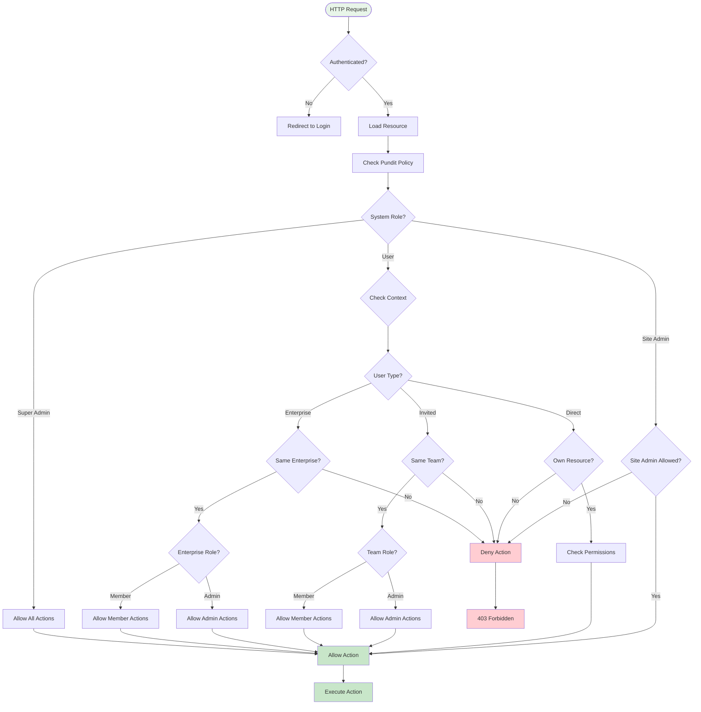
```mermaid
flowchart TD
    Request([HTTP Request]) --> Auth{Authenticated?}
    
    Auth -->|No| RedirectLogin[Redirect to Login]
    Auth -->|Yes| LoadResource[Load Resource]
    
    LoadResource --> CheckPolicy[Check Pundit Policy]
    CheckPolicy --> SystemRole{System Role?}
    
    SystemRole -->|Super Admin| AllowAll[Allow All Actions]
    SystemRole -->|Site Admin| CheckSiteAdmin{Site Admin Allowed?}
    SystemRole -->|User| CheckUserContext{Check Context}
    
    CheckSiteAdmin -->|Yes| AllowAction[Allow Action]
    CheckSiteAdmin -->|No| DenyAction[Deny Action]
    
    CheckUserContext --> UserType{User Type?}
    
    UserType -->|Direct| CheckDirect{Own Resource?}
    UserType -->|Invited| CheckTeam{Same Team?}
    UserType -->|Enterprise| CheckEnt{Same Enterprise?}
    
    CheckDirect -->|Yes| CheckDirectPerms[Check Permissions]
    CheckDirect -->|No| DenyAction
    
    CheckTeam -->|Yes| CheckTeamRole{Team Role?}
    CheckTeam -->|No| DenyAction
    
    CheckEnt -->|Yes| CheckEntRole{Enterprise Role?}
    CheckEnt -->|No| DenyAction
    
    CheckTeamRole -->|Admin| AllowTeamAdmin[Allow Admin Actions]
    CheckTeamRole -->|Member| AllowMember[Allow Member Actions]
    
    CheckEntRole -->|Admin| AllowEntAdmin[Allow Admin Actions]
    CheckEntRole -->|Member| AllowEntMember[Allow Member Actions]
    
    CheckDirectPerms --> AllowAction
    AllowTeamAdmin --> AllowAction
    AllowMember --> AllowAction
    AllowEntAdmin --> AllowAction
    AllowEntMember --> AllowAction
    AllowAll --> AllowAction
    
    AllowAction --> ExecuteAction[Execute Action]
    DenyAction --> Return403[403 Forbidden]
    
    style Request fill:#e8f5e9
    style AllowAction fill:#c8e6c9
    style ExecuteAction fill:#c8e6c9
    style DenyAction fill:#ffcdd2
    style Return403 fill:#ffcdd2
```

## Team Management Flows

### Team Member Management

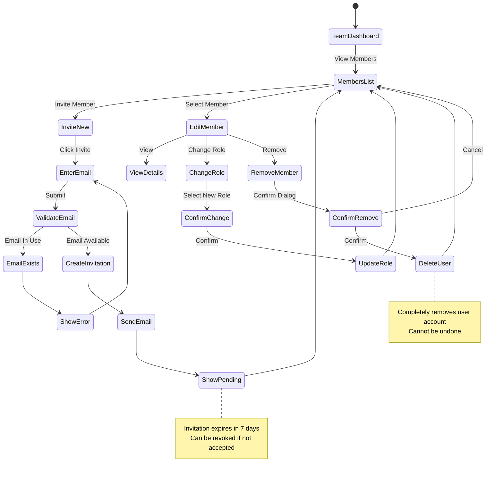
```mermaid
stateDiagram-v2
    [*] --> TeamDashboard
    
    TeamDashboard --> MembersList : View Members
    
    MembersList --> InviteNew : Invite Member
    MembersList --> EditMember : Select Member
    
    InviteNew --> EnterEmail : Click Invite
    EnterEmail --> ValidateEmail : Submit
    
    ValidateEmail --> EmailExists : Email In Use
    ValidateEmail --> CreateInvitation : Email Available
    
    EmailExists --> ShowError
    ShowError --> EnterEmail
    
    CreateInvitation --> SendEmail
    SendEmail --> ShowPending
    ShowPending --> MembersList
    
    EditMember --> ViewDetails : View
    EditMember --> ChangeRole : Change Role
    EditMember --> RemoveMember : Remove
    
    ChangeRole --> ConfirmChange : Select New Role
    ConfirmChange --> UpdateRole : Confirm
    UpdateRole --> MembersList
    
    RemoveMember --> ConfirmRemove : Confirm Dialog
    ConfirmRemove --> DeleteUser : Confirm
    ConfirmRemove --> MembersList : Cancel
    DeleteUser --> MembersList
    
    note right of DeleteUser
        Completely removes user account
        Cannot be undone
    end note
    
    note right of ShowPending
        Invitation expires in 7 days
        Can be revoked if not accepted
    end note
```

### Billing Management Flow

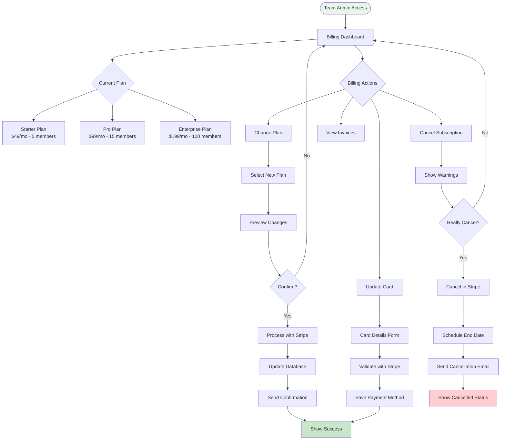
```mermaid
flowchart TD
    Start([Team Admin Access]) --> Billing[Billing Dashboard]
    
    Billing --> ViewCurrent{Current Plan}
    ViewCurrent --> Starter[Starter Plan<br/>$49/mo - 5 members]
    ViewCurrent --> Pro[Pro Plan<br/>$99/mo - 15 members]
    ViewCurrent --> Enterprise[Enterprise Plan<br/>$199/mo - 100 members]
    
    Billing --> Actions{Billing Actions}
    
    Actions --> ChangePlan[Change Plan]
    Actions --> UpdateCard[Update Card]
    Actions --> CancelSub[Cancel Subscription]
    Actions --> ViewInvoices[View Invoices]
    
    ChangePlan --> SelectNew[Select New Plan]
    SelectNew --> PreviewChange[Preview Changes]
    PreviewChange --> ConfirmChange{Confirm?}
    ConfirmChange -->|Yes| ProcessChange[Process with Stripe]
    ConfirmChange -->|No| Billing
    
    ProcessChange --> UpdateDB[Update Database]
    UpdateDB --> SendConfirm[Send Confirmation]
    SendConfirm --> ShowSuccess[Show Success]
    
    UpdateCard --> CardForm[Card Details Form]
    CardForm --> ValidateCard[Validate with Stripe]
    ValidateCard --> SaveCard[Save Payment Method]
    SaveCard --> ShowSuccess
    
    CancelSub --> CancelWarn[Show Warnings]
    CancelWarn --> ConfirmCancel{Really Cancel?}
    ConfirmCancel -->|Yes| ProcessCancel[Cancel in Stripe]
    ConfirmCancel -->|No| Billing
    
    ProcessCancel --> ScheduleEnd[Schedule End Date]
    ScheduleEnd --> SendCancelEmail[Send Cancellation Email]
    SendCancelEmail --> ShowCancelled[Show Cancelled Status]
    
    style Start fill:#e8f5e9
    style ShowSuccess fill:#c8e6c9
    style ShowCancelled fill:#ffcdd2
```

## User Journey Maps

### Direct User Journey (Updated with New Onboarding)

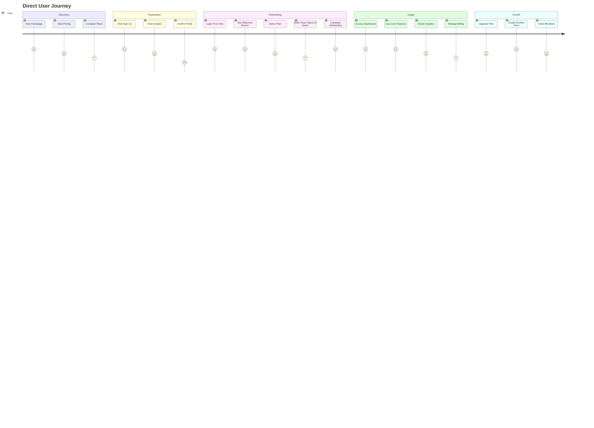
```mermaid
journey
    title Direct User Journey
    
    section Discovery
      Visit Homepage: 5: User
      View Pricing: 4: User
      Compare Plans: 3: User
    
    section Registration
      Click Sign Up: 5: User
      Enter Details: 4: User
      Confirm Email: 2: User
    
    section Onboarding
      Login First Time: 5: User
      See Welcome Screen: 5: User
      Select Plan: 4: User
      Enter Team Name (if team): 3: User
      Complete Onboarding: 5: User
    
    section Usage
      Access Dashboard: 5: User
      Use Core Features: 5: User
      Check Analytics: 4: User
      Manage Billing: 3: User
    
    section Growth
      Upgrade Plan: 4: User
      Create Another Team: 5: User
      Invite Members: 4: User
```

### Team Member Journey

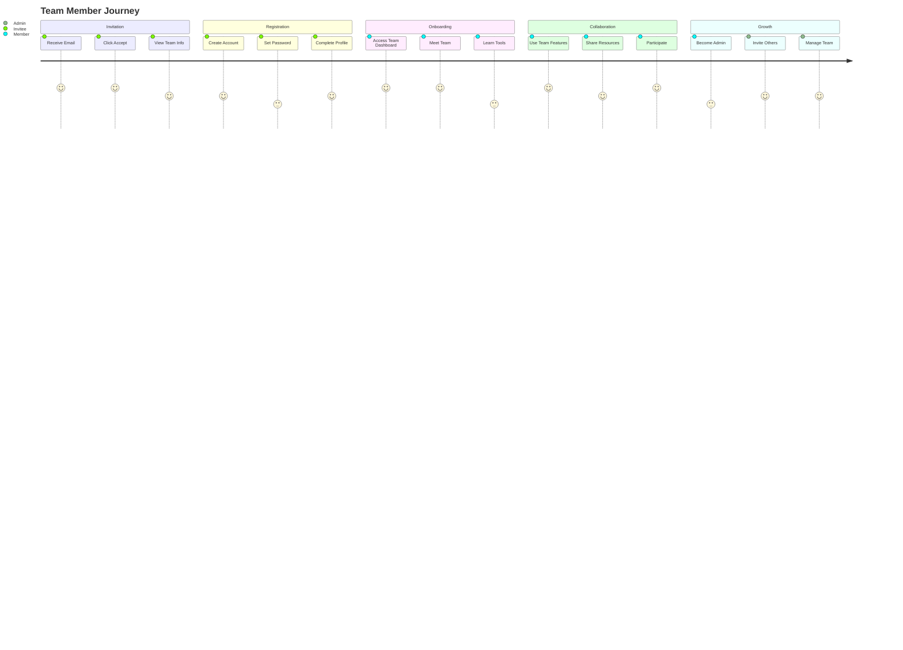
```mermaid
journey
    title Team Member Journey
    
    section Invitation
      Receive Email: 5: Invitee
      Click Accept: 5: Invitee
      View Team Info: 4: Invitee
    
    section Registration
      Create Account: 4: Invitee
      Set Password: 3: Invitee
      Complete Profile: 4: Invitee
    
    section Onboarding
      Access Team Dashboard: 5: Member
      Meet Team: 5: Member
      Learn Tools: 3: Member
    
    section Collaboration
      Use Team Features: 5: Member
      Share Resources: 4: Member
      Participate: 5: Member
    
    section Growth
      Become Admin: 3: Member
      Invite Others: 4: Admin
      Manage Team: 4: Admin
```

## Admin Feature Flows

### Super Admin Email Change Flow

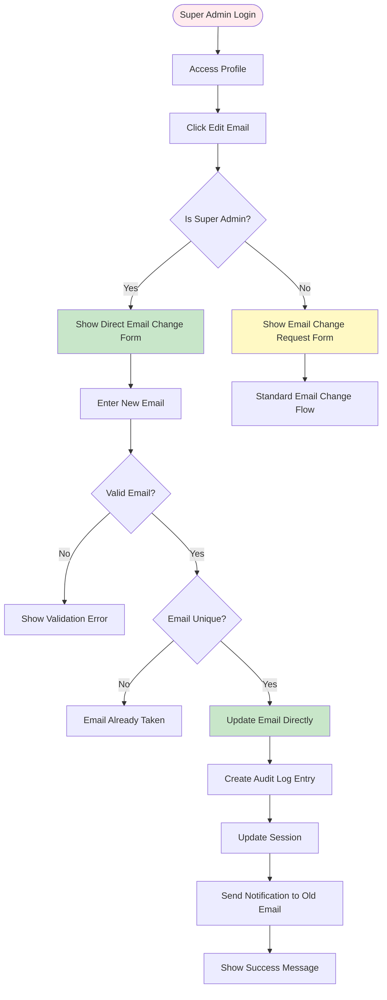
```mermaid
flowchart TD
    Start([Super Admin Login]) --> Profile[Access Profile]
    Profile --> EditEmail[Click Edit Email]
    EditEmail --> CheckRole{Is Super Admin?}
    
    CheckRole -->|No| ShowRequest[Show Email Change Request Form]
    CheckRole -->|Yes| ShowDirect[Show Direct Email Change Form]
    
    ShowDirect --> EnterNew[Enter New Email]
    EnterNew --> Validate{Valid Email?}
    Validate -->|No| ShowError[Show Validation Error]
    Validate -->|Yes| CheckUnique{Email Unique?}
    
    CheckUnique -->|No| ShowTaken[Email Already Taken]
    CheckUnique -->|Yes| UpdateEmail[Update Email Directly]
    
    UpdateEmail --> AuditLog[Create Audit Log Entry]
    AuditLog --> UpdateSession[Update Session]
    UpdateSession --> SendNotif[Send Notification to Old Email]
    SendNotif --> ShowSuccess[Show Success Message]
    
    ShowRequest --> StandardFlow[Standard Email Change Flow]
    
    style Start fill:#ffebee
    style ShowDirect fill:#c8e6c9
    style UpdateEmail fill:#c8e6c9
    style ShowRequest fill:#fff9c4
```

### Admin Subscription Bypass

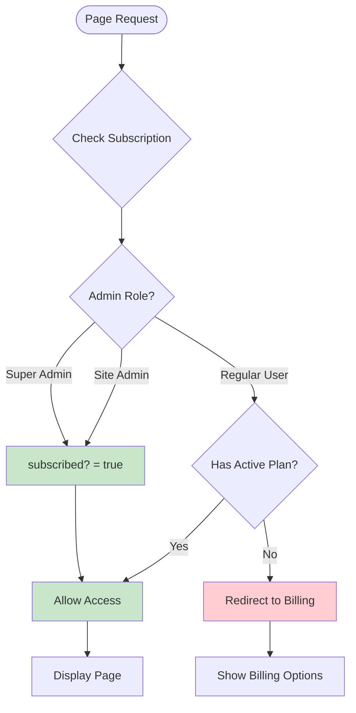
```mermaid
flowchart TD
    Request([Page Request]) --> CheckSub{Check Subscription}
    CheckSub --> IsAdmin{Admin Role?}
    
    IsAdmin -->|Super Admin| BypassSub[subscribed? = true]
    IsAdmin -->|Site Admin| BypassSub
    IsAdmin -->|Regular User| CheckPlan{Has Active Plan?}
    
    CheckPlan -->|Yes| AllowAccess[Allow Access]
    CheckPlan -->|No| RequireSub[Redirect to Billing]
    
    BypassSub --> AllowAccess
    AllowAccess --> ShowPage[Display Page]
    
    RequireSub --> BillingPage[Show Billing Options]
    
    style BypassSub fill:#c8e6c9
    style AllowAccess fill:#c8e6c9
    style RequireSub fill:#ffcdd2
```

## UI/UX Navigation Flows

### Tailwind UI Sidebar Navigation

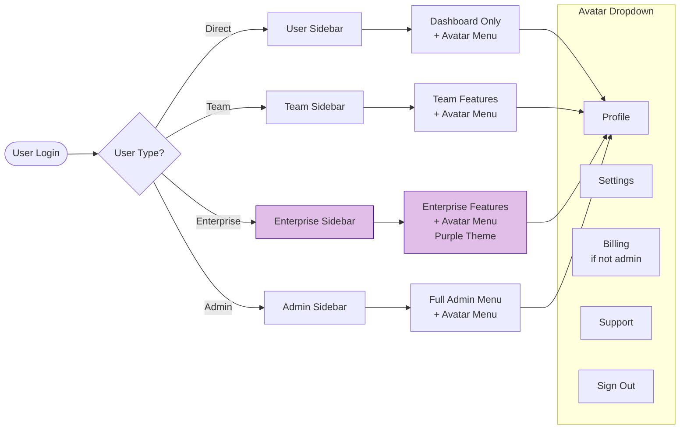
```mermaid
flowchart LR
    Login([User Login]) --> CheckType{User Type?}
    
    CheckType -->|Direct| DirectNav[User Sidebar]
    CheckType -->|Team| TeamNav[Team Sidebar]
    CheckType -->|Enterprise| EntNav[Enterprise Sidebar]
    CheckType -->|Admin| AdminNav[Admin Sidebar]
    
    DirectNav --> DirectItems[Dashboard Only<br/>+ Avatar Menu]
    TeamNav --> TeamItems[Team Features<br/>+ Avatar Menu]
    EntNav --> EntItems[Enterprise Features<br/>+ Avatar Menu<br/>Purple Theme]
    AdminNav --> AdminItems[Full Admin Menu<br/>+ Avatar Menu]
    
    subgraph "Avatar Dropdown"
        Profile[Profile]
        Settings[Settings]
        Billing[Billing<br/>if not admin]
        Support[Support]
        SignOut[Sign Out]
    end
    
    DirectItems --> Profile
    TeamItems --> Profile
    EntItems --> Profile
    AdminItems --> Profile
    
    style EntNav fill:#e1bee7,stroke:#4a148c
    style EntItems fill:#e1bee7,stroke:#4a148c
```

## Error & Recovery Flows

### Password Reset Flow

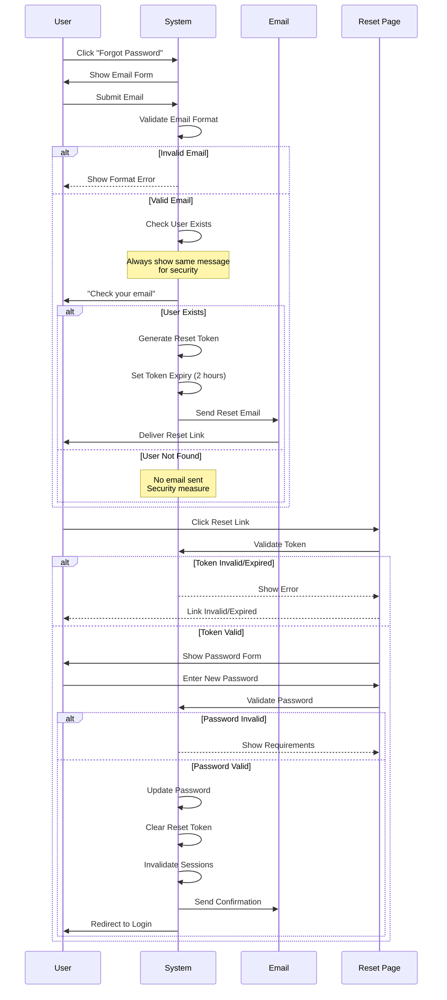
```mermaid
sequenceDiagram
    participant User
    participant System
    participant Email
    participant Reset as Reset Page
    
    User->>System: Click "Forgot Password"
    System->>User: Show Email Form
    User->>System: Submit Email
    
    System->>System: Validate Email Format
    alt Invalid Email
        System-->>User: Show Format Error
    else Valid Email
        System->>System: Check User Exists
        
        Note over System: Always show same message<br/>for security
        
        System->>User: "Check your email"
        
        alt User Exists
            System->>System: Generate Reset Token
            System->>System: Set Token Expiry (2 hours)
            System->>Email: Send Reset Email
            Email->>User: Deliver Reset Link
        else User Not Found
            Note over System: No email sent<br/>Security measure
        end
    end
    
    User->>Reset: Click Reset Link
    Reset->>System: Validate Token
    
    alt Token Invalid/Expired
        System-->>Reset: Show Error
        Reset-->>User: Link Invalid/Expired
    else Token Valid
        Reset->>User: Show Password Form
        User->>Reset: Enter New Password
        Reset->>System: Validate Password
        
        alt Password Invalid
            System-->>Reset: Show Requirements
        else Password Valid
            System->>System: Update Password
            System->>System: Clear Reset Token
            System->>System: Invalidate Sessions
            System->>Email: Send Confirmation
            System->>User: Redirect to Login
        end
    end
```

### Account Recovery Flow

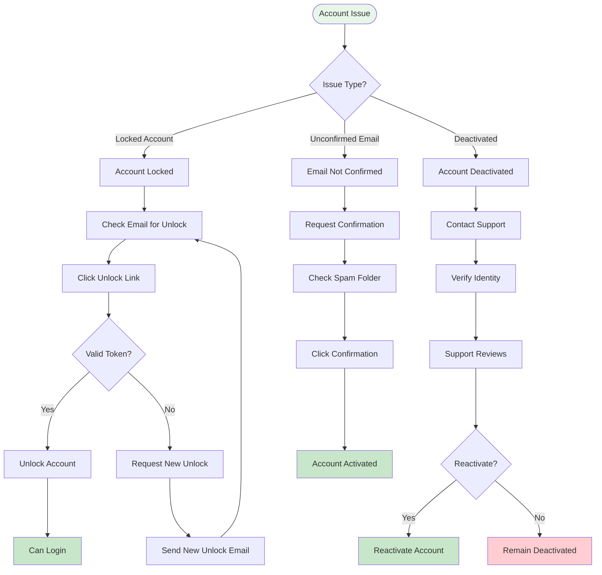
```mermaid
flowchart TD
    Start([Account Issue]) --> Type{Issue Type?}
    
    Type -->|Locked Account| Locked[Account Locked]
    Type -->|Unconfirmed Email| Unconfirmed[Email Not Confirmed]
    Type -->|Deactivated| Deactivated[Account Deactivated]
    
    Locked --> CheckEmail[Check Email for Unlock]
    CheckEmail --> ClickUnlock[Click Unlock Link]
    ClickUnlock --> ValidateToken{Valid Token?}
    ValidateToken -->|Yes| UnlockAccount[Unlock Account]
    ValidateToken -->|No| RequestNew[Request New Unlock]
    UnlockAccount --> CanLogin[Can Login]
    
    Unconfirmed --> ResendConfirm[Request Confirmation]
    ResendConfirm --> CheckSpam[Check Spam Folder]
    CheckSpam --> ClickConfirm[Click Confirmation]
    ClickConfirm --> AccountActive[Account Activated]
    
    Deactivated --> ContactSupport[Contact Support]
    ContactSupport --> VerifyIdentity[Verify Identity]
    VerifyIdentity --> ReviewCase[Support Reviews]
    ReviewCase --> Decision{Reactivate?}
    Decision -->|Yes| Reactivate[Reactivate Account]
    Decision -->|No| StayDeactivated[Remain Deactivated]
    
    RequestNew --> SendNewUnlock[Send New Unlock Email]
    SendNewUnlock --> CheckEmail
    
    style Start fill:#e8f5e9
    style CanLogin fill:#c8e6c9
    style AccountActive fill:#c8e6c9
    style Reactivate fill:#c8e6c9
    style StayDeactivated fill:#ffcdd2
```

## Performance & Background Processing Flows

### Activity Tracking Flow

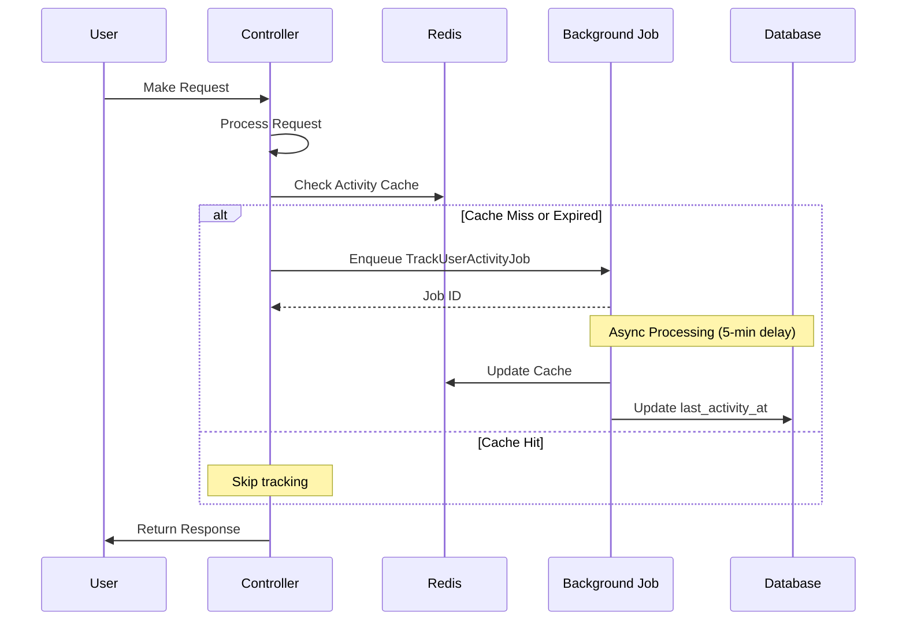
```mermaid
sequenceDiagram
    participant User
    participant Controller
    participant Redis
    participant Job as Background Job
    participant DB as Database
    
    User->>Controller: Make Request
    Controller->>Controller: Process Request
    Controller->>Redis: Check Activity Cache
    
    alt Cache Miss or Expired
        Controller->>Job: Enqueue TrackUserActivityJob
        Job-->>Controller: Job ID
        
        Note over Job,DB: Async Processing (5-min delay)
        Job->>Redis: Update Cache
        Job->>DB: Update last_activity_at
    else Cache Hit
        Note over Controller: Skip tracking
    end
    
    Controller->>User: Return Response
```

### Query Optimization Flow

```mermaid
flowchart TD
    Request([Controller Request]) --> CheckQuery{Complex Query?}
    
    CheckQuery -->|Simple| DirectQuery[Model.where(...)]
    CheckQuery -->|Complex| QueryObject[Use Query Object]
    
    QueryObject --> UsersQuery[UsersQuery<br/>TeamsQuery]
    UsersQuery --> AddIncludes[Add Eager Loading]
    AddIncludes --> AddScopes[Add Scopes]
    AddScopes --> PreCalc[Pre-calculate Stats]
    
    DirectQuery --> CheckN1{N+1 Risk?}
    CheckN1 -->|Yes| AddEager[Add includes/preload]
    CheckN1 -->|No| Execute[Execute Query]
    
    AddEager --> Execute
    PreCalc --> Execute
    Execute --> CheckCache{Cacheable?}
    
    CheckCache -->|Yes| CacheResult[Cache Results]
    CheckCache -->|No| ReturnData[Return Data]
    
    CacheResult --> ReturnData
    
    style QueryObject fill:#c8e6c9
    style CacheResult fill:#e3f2fd
```

## Current State & Technical Debt

### Application Health Status

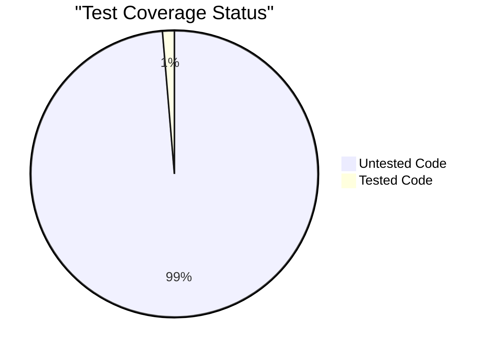
```mermaid
pie title "Test Coverage Status"
    "Untested Code" : 98.67
    "Tested Code" : 1.33
```

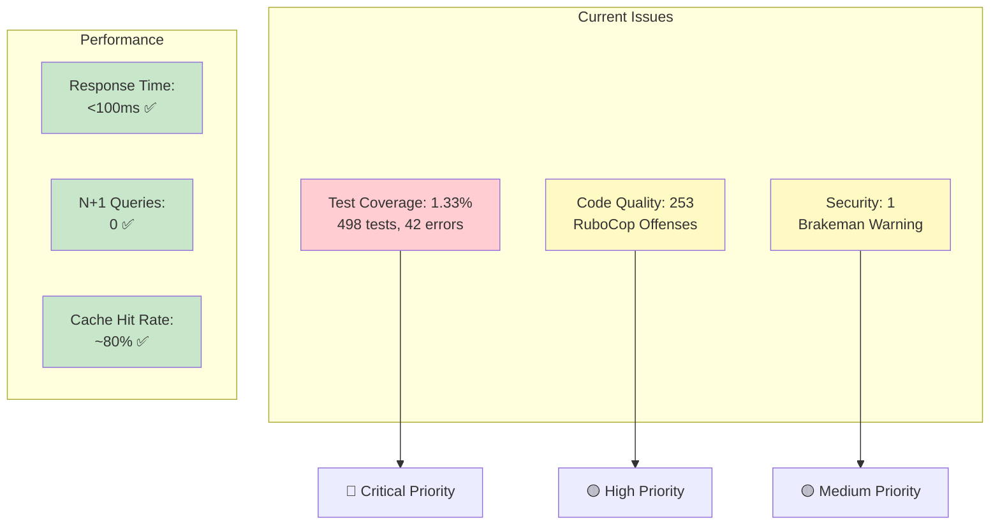
```mermaid
flowchart TD
    subgraph "Current Issues"
        Test[Test Coverage: 1.33%<br/>498 tests, 42 errors]
        Code[Code Quality: 253<br/>RuboCop Offenses]
        Security[Security: 1<br/>Brakeman Warning]
    end
    
    subgraph "Performance"
        Response[Response Time:<br/><100ms ✅]
        Queries[N+1 Queries:<br/>0 ✅]
        Cache[Cache Hit Rate:<br/>~80% ✅]
    end
    
    Test --> Priority1[🔴 Critical Priority]
    Code --> Priority2[🟡 High Priority]
    Security --> Priority3[🟡 Medium Priority]
    
    style Test fill:#ffcdd2
    style Code fill:#fff9c4
    style Security fill:#fff9c4
    style Response fill:#c8e6c9
    style Queries fill:#c8e6c9
    style Cache fill:#c8e6c9
```

---

**Last Updated**: January 2025
**Previous**: [System Overview](system-overview.md)
**Next**: [Database ERD](database-erd.md)
**Return to**: [Architecture Overview](../README.md)