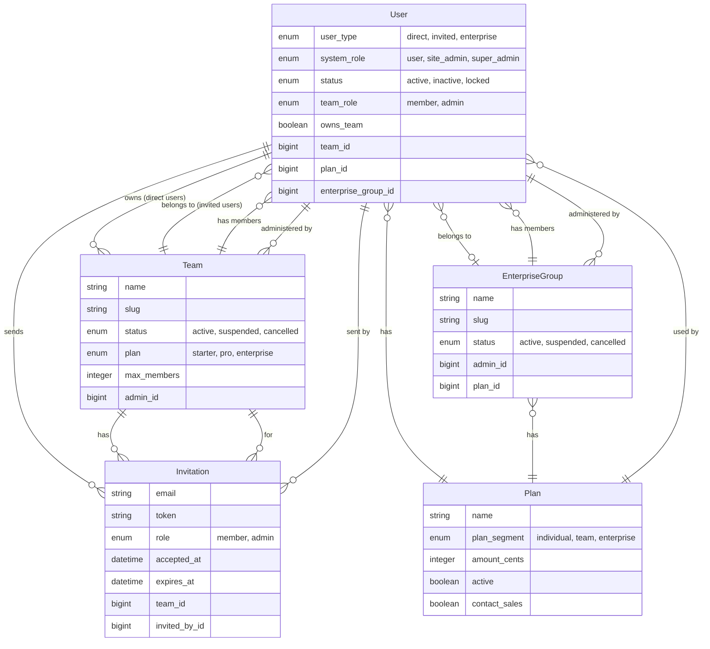
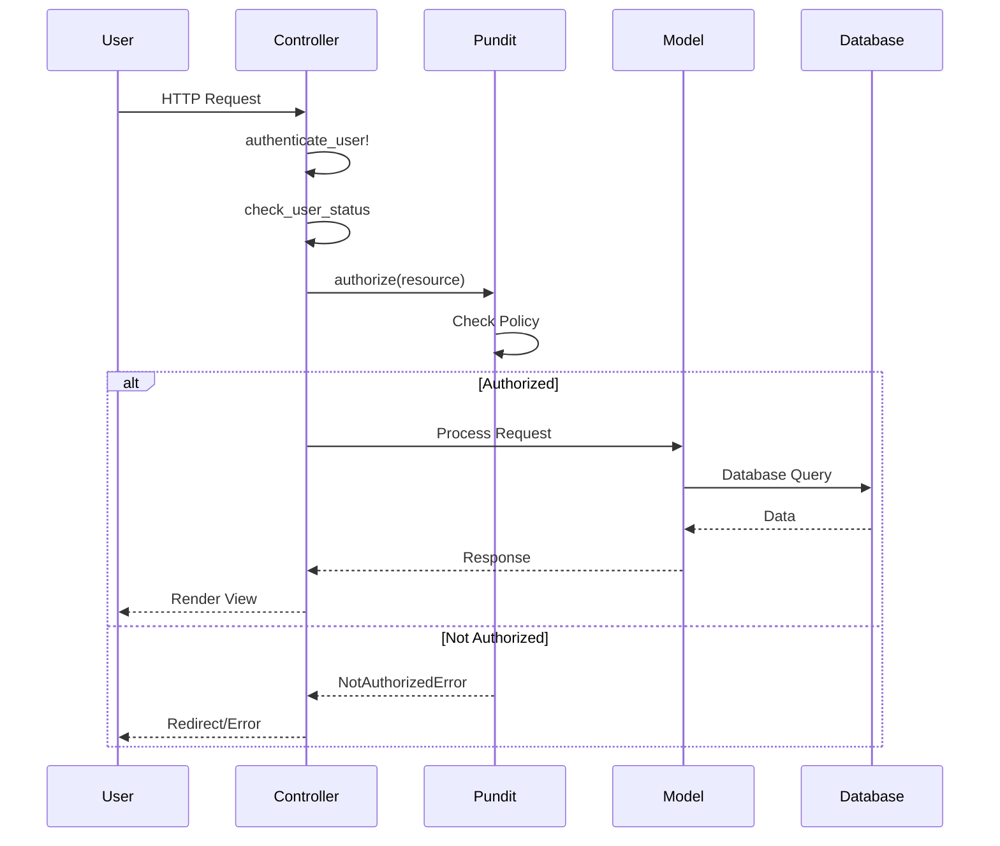
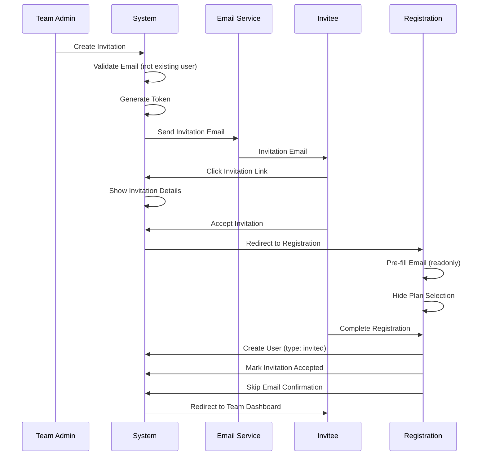
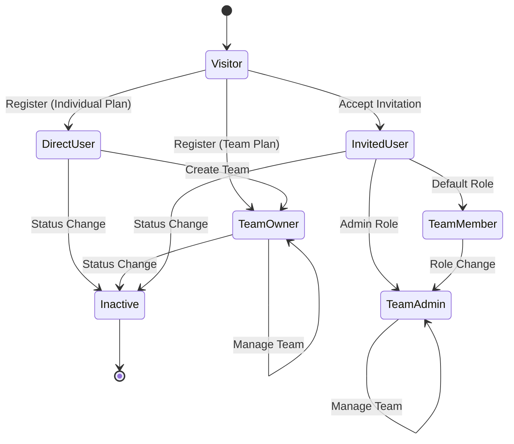
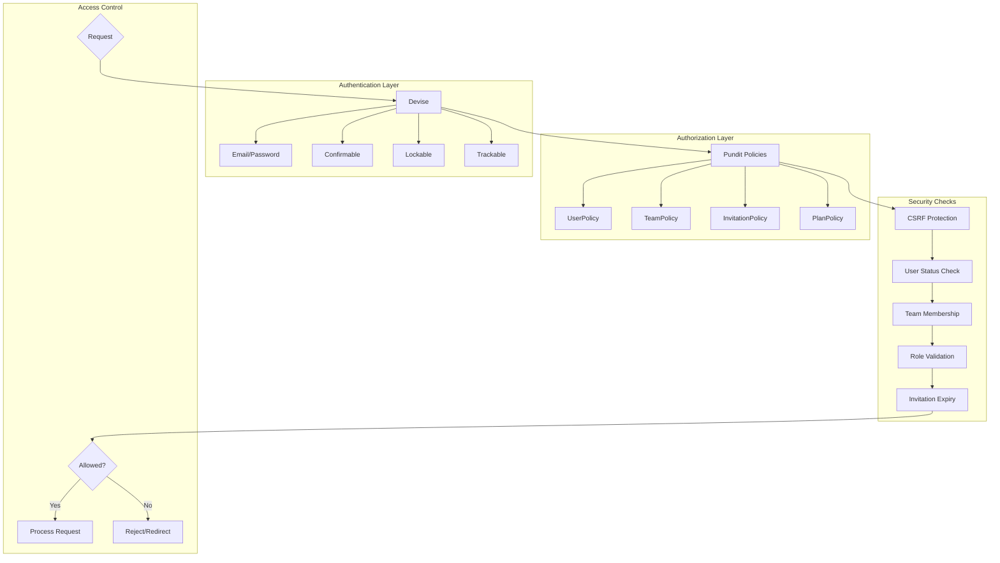
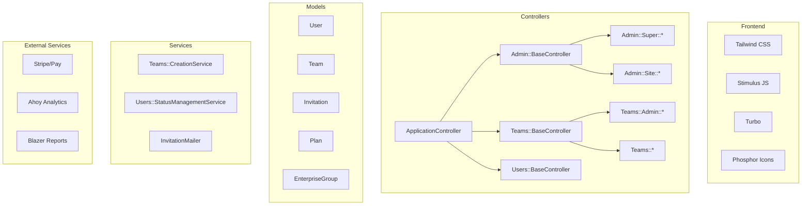
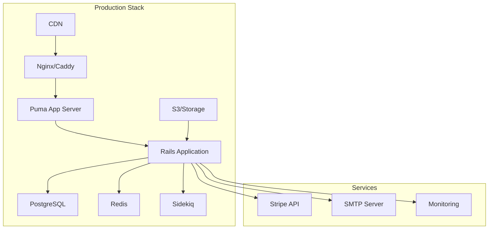

# System Architecture Diagram

## User Types & Access Flow

```mermaid
graph TB
    subgraph "Public Access"
        A[Public Homepage] --> B[Sign Up]
        A --> C[Sign In]
        A --> D[Pricing]
        A --> E[Features]
    end

    subgraph "Registration Paths"
        B --> F[Direct User Registration]
        F --> G{Choose Plan}
        G -->|Individual Plan| H[Individual User Created]
        G -->|Team Plan| I[Team Name Field Required]
        I --> J[Team + User Created<br/>owns_team: true]
        
        K[Invitation Link] --> L[Accept Invitation]
        L --> M[Invited User Registration<br/>Email Pre-filled]
        M --> N[Invited User Created<br/>Skip Confirmation]
        
        ES[Contact Sales] --> EP[Enterprise Process]
        EP --> EU[Enterprise User Created]
    end

    subgraph "User Types"
        O[Super Admin<br/>system_role: super_admin]
        P[Site Admin<br/>system_role: site_admin]
        Q[Direct User<br/>user_type: direct]
        R[Invited User<br/>user_type: invited]
        S[Enterprise User<br/>user_type: enterprise]
    end

    subgraph "Access Levels"
        O --> T[/admin/super/*]
        P --> U[/admin/site/*]
        Q --> V[/dashboard]
        Q --> W[/teams/team-slug/*<br/>if owns_team]
        R --> W
        S --> X[/enterprise/group-slug/*]
    end

    subgraph "Team Management"
        Y[Team Admin<br/>team_role: admin] --> Z[Send Invitations]
        Y --> AA[Manage Members]
        Y --> AB[Team Settings]
        Y --> AC[Team Billing]
        Y --> AR[Revoke Invitations<br/>Only if not accepted]
        
        AD[Team Member<br/>team_role: member] --> AE[Team Features]
        AD --> AF[Profile]
    end

    H --> V
    J --> W
    N --> W
    EU --> X
    Q -.->|Can create team| Y
    R -.->|Can be| Y
    R -.->|Can be| AD
    S -.->|Can be| Y
```

## Database Relationships



## Request Flow



## Invitation Flow



## State Transitions



## Security Model



## Component Architecture



## Deployment Architecture



---

Last Updated: June 2025