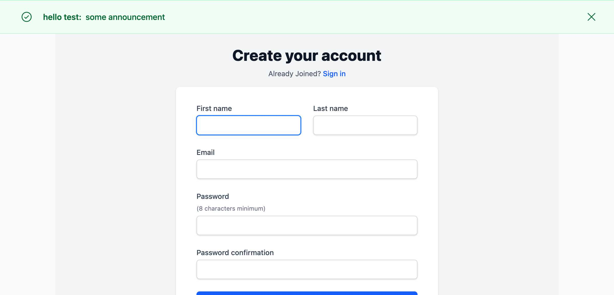
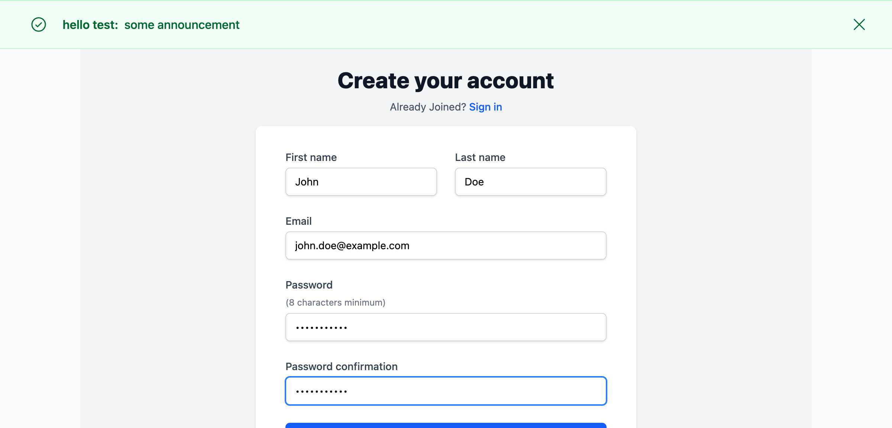
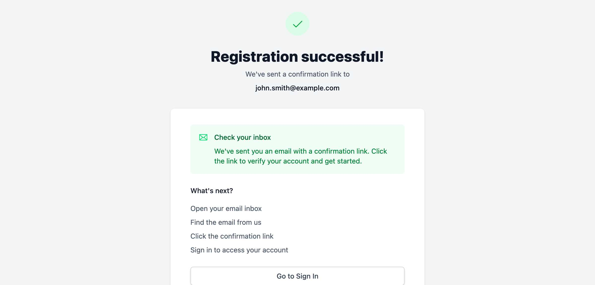
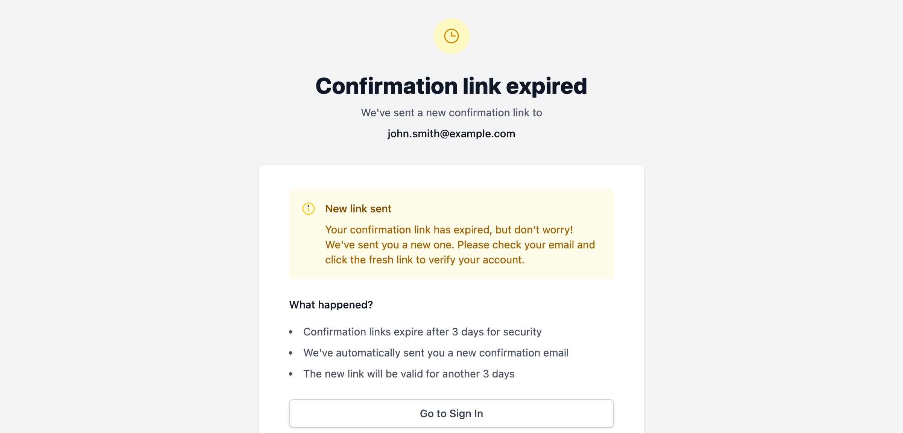
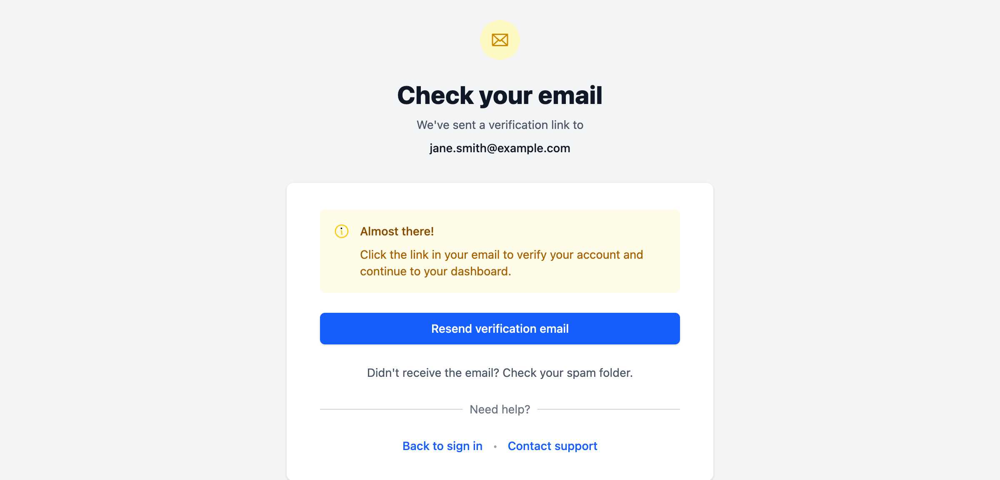
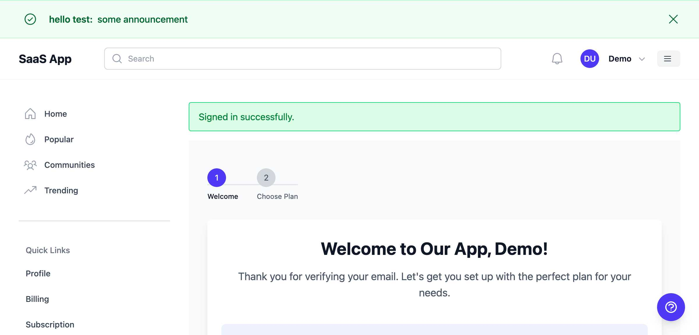
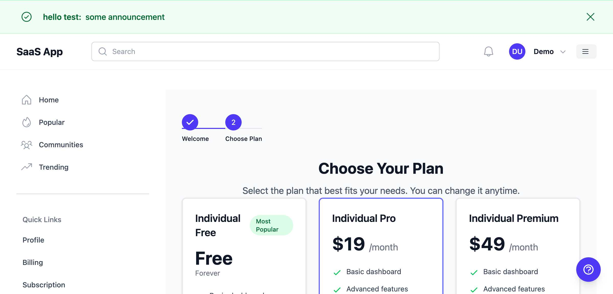
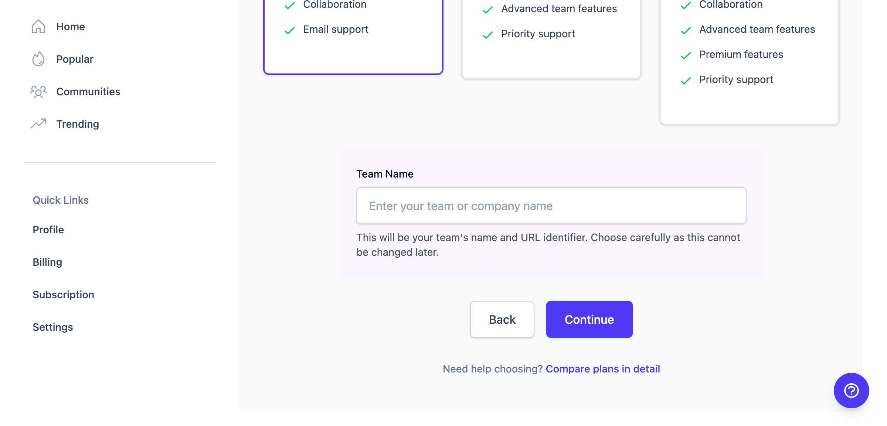

# Direct User Registration & Onboarding Guide

*Last Updated: July 2025*

This guide walks you through the complete registration and onboarding process for direct users in the SaaS application.

## Overview

The direct user registration flow has been redesigned to provide a smoother and more secure onboarding experience. The process now includes mandatory email verification before accessing the application:

1. Register with basic information
2. Receive a verification email
3. Verify email address (required before accessing the app)
4. Complete an onboarding flow where they select their plan
5. If choosing a team plan, provide a team name

**Important**: Email verification is mandatory. Unverified users who try to sign in will be directed to an email verification screen and cannot access any application features until their email is confirmed.

## Step 1: Registration

### Navigate to Sign Up

Visit `/users/sign_up` or click the "Sign Up" link from the homepage.

### Fill Out the Registration Form

Enter your basic information:
- **First Name**: Your given name
- **Last Name**: Your family name  
- **Email**: A valid email address for account verification
- **Password**: Must be at least 8 characters, include uppercase letter and special character
- **Password Confirmation**: Re-enter your password

**Note**: Plan selection is no longer part of the registration process. You'll choose your plan after email verification.

### Submit Registration

Click the "Create Account" button to complete registration. You'll receive an email to verify your account.

## Step 2: Email Verification

After successful registration, you'll be redirected to a confirmation page:

This page:
- Confirms your registration was successful
- Shows the email address where verification was sent
- Provides clear instructions on next steps
- Includes a button to go to the sign-in page

### Verification Email

Check your email inbox for the verification message. The email will:
- Come from our system email address
- Include a verification link
- Be valid for 3 days

### Clicking the Verification Link

When you click the verification link in your email:
- If the link is valid, your email will be confirmed
- You'll be redirected to the sign-in page with a success message
- You can now sign in and access the application

### Expired Verification Links

If your verification link has expired (after 3 days):

- You'll see a message that the link has expired
- A new verification email will be sent automatically
- Check your inbox for the fresh verification link

### Signing In Before Verification

If you try to sign in before clicking the verification link:

This screen:
- Shows that email verification is pending
- Displays your email address
- Provides a "Resend verification email" button
- Includes helpful tips (check spam folder, etc.)
- Offers links to sign out or contact support

**Important**: You cannot access any application features until your email is verified. This ensures account security and valid communication.

### Resending Verification Email

If you don't receive the verification email:
1. Check your spam/junk folder first
2. Click the "Resend verification email" button
3. Wait a few minutes as emails can sometimes be delayed
4. Add noreply@[yourdomain] to your contacts to prevent future emails from going to spam

## Step 3: Onboarding - Welcome Screen

After verifying your email and signing in, you'll see the onboarding welcome screen:

This screen:
- Welcomes you by name
- Explains the next steps
- Shows the benefits of different plan types
- Provides a clear "Continue to Plan Selection" button

## Step 4: Plan Selection

Click "Continue to Plan Selection" to choose your plan:

### Available Plans

#### Individual Plans
- **Free**: Basic dashboard and email support (Free forever)
- **Pro ($19/month)**: Advanced features and priority support
- **Premium ($49/month)**: All features plus phone support

#### Team Plans
- **Starter ($49/month)**: Up to 5 team members
- **Pro ($99/month)**: Up to 15 team members with advanced features
- **Premium ($199/month)**: Up to 50 team members with all features

### Selecting a Team Plan

If you select any team plan, a team name field will appear:

**Important**: 
- The team name becomes your team's URL identifier
- Choose carefully as this cannot be changed later
- Use a name that represents your team or company

## Step 5: Complete Onboarding

After selecting your plan (and entering a team name if applicable):

1. Click the "Continue" button
2. Your plan will be set up
3. If you chose a team plan, your team will be created
4. You'll be redirected to your dashboard

## What Happens Next?

### After Email Verification
Once your email is verified and you sign in:
1. You'll be directed to the onboarding welcome screen
2. Choose your plan (individual or team)
3. Complete the setup
4. Access your dashboard

### Security Benefits of Email Verification
By requiring email verification before any access, we ensure:
- Only legitimate users can access the application
- Account ownership is properly verified before plan selection
- Reduced risk of spam or fraudulent accounts
- Better communication channel for important updates
- No unauthorized access to application features

### For Individual Plan Users
- Access your personal dashboard at `/dashboard`
- Manage your subscription and billing
- Use all features included in your plan

### For Team Plan Users  
- Access your team dashboard at `/teams/your-team-name/`
- As the team creator, you have admin privileges
- Invite team members via email
- Manage team billing and settings

## Common Questions

### Can I change my plan later?
Yes, you can upgrade, downgrade, or change your plan anytime from your dashboard.

### What if I'm unsure which plan to choose?
- Individual plans are perfect for personal use and solo projects
- Team plans are ideal for collaboration with team members
- You can start with a free plan and upgrade when needed

### Why do I need to verify my email before accessing the app?
Email verification is required for security reasons:
- Ensures you own the email address
- Prevents spam and fake accounts
- Protects your account from unauthorized access
- Required before you can select a plan or access features

### Why can't I select a plan during registration?
This change improves the user experience by:
- Simplifying the initial registration
- Requiring email verification first for security
- Providing better plan information during onboarding
- Allowing you to explore options before committing

### What if I don't receive the verification email?
If you don't receive the verification email:
1. Check your spam/junk folder
2. Sign in and click "Resend verification email" on the verification screen
3. Make sure you entered the correct email address
4. Add our email domain to your safe senders list
5. Contact support if you still have issues

### What if the JavaScript for team name field doesn't work?
The team name field should automatically appear when selecting a team plan. If it doesn't:
1. Ensure JavaScript is enabled in your browser
2. Try refreshing the page
3. Contact support if the issue persists

## Need Help?

If you encounter any issues during registration or onboarding:
- Check our [FAQ section](/faq)
- Contact support at support@example.com
- Use the "Help & Support" button available on all pages